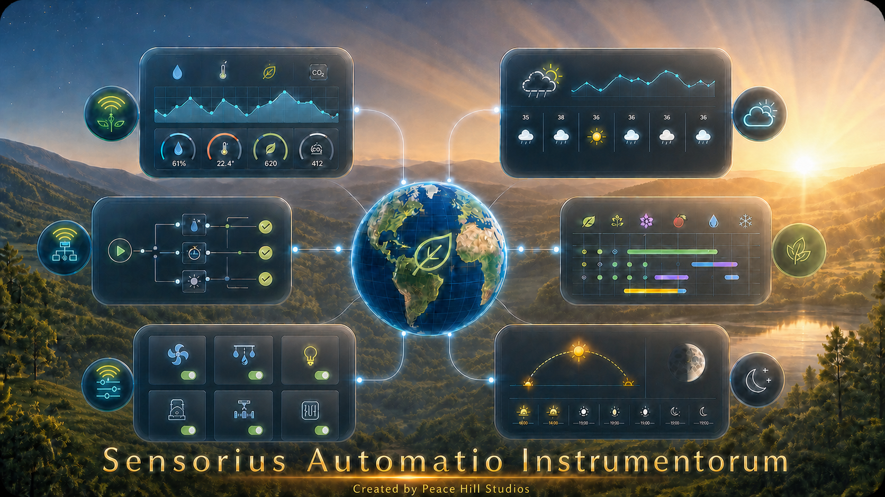

<p align="center">
  
</p>

# Sensorius User Guide

Sensorius Automatio Instrumentorum, also called Sensorius AI or Sensorius, is an environmental sensing and automation hub for gardens, greenhouses, grow rooms, small farms, and other places where environmental conditions matter. It gives you live readings, historical graphs, switch control, calibration tools, fully integrated Caelus Weather Forecast, Maria Thun-inspired Biodynamic Calendar, and optional integrations with Home Assistant, WeeWX, and farmOS.

Sensorius can run as a Raspberry Pi hub with directly connected sensors and relays, as well as Wi-Fi Nodus sensors and switches that communicate via a lightweight, open-standard communications protocal, MQTT (Message Queuing Telemetry Transport), as well as Ecowitt Gateways (GW1100/GW1200) with weather sensor integration.

Sensorius can also run on macOS, Windows, or Linux as a hub for Wi-Fi Nodus sensors and switches, as well as Ecowitt Gateways (GW1100/GW1200) with weather sensor integration. In normal use, both kinds of devices appear together on the same dashboard.

<!-- pdf-keep-together:start -->
## Dashboard Overview

The dashboard is the main operating view. It is where you check current conditions, see switch state, open settings, and review quick trends.


<!-- pdf-keep-together:end -->

This example and the dashboard dialogs shown throughout this guide were
captured from the live **Samhain** Sensorius installation with its saved
**Fruit** dashboard theme selected. The greenhouse background and warm
peach-and-brown palette therefore continue behind and through the dialog views. Sensor
names, locations, metrics, switch channels, forecast source, selected theme,
and live values will vary by installation.

The dashboard presents:
### Interface Icons

-  The
  **Graph icon**—a blue line graph on horizontal and vertical axes—opens
  the full-screen **Sensorius Graphum** workspace.
-  The
  **Settings icon (gear)** beside **Sensorius AI** opens General Settings.
  Other gear icons open settings for the associated sensor or switch, or open
  the timer control for a Switch Tile.

Sensorius uses the following expand and collapse controls throughout the
interface:

- A **right-pointing triangle (▶)** means that additional content is collapsed;
  select it to expand the content.
- A **down-pointing triangle (▼)** means that the content is expanded; select it
  to collapse the content.
- General Settings sections, integration blocks, and other expandable panes use
  these same right/down disclosure triangles.
- A dashboard Sensor Group shows a disclosure triangle only when it has more
  than six Sensor Tiles. The first six Sensor Tiles remain visible when the
  group is collapsed.
- Sensorius Graphum uses **+** to expand a sensor or switch selector and **−**
  to collapse it. Collapsing a selector does not clear its checked items.

The **three horizontal bars** beside a Sensor Group heading open its **Move up**
and **Move down** commands. Expand and collapse controls change only what is
visible; they do not change sensor settings, switch state, or saved selections.
Reordering sensor groups does not move the Sensorius overview graphic from the
bottom of the dashboard.

Dashboard data comes from the latest values in the live runtime cache and from the local database. If a device is offline, the latest stored reading may still be visible, but the online/offline state comes from live device status, MQTT heartbeat or availability messages, and recent packets.

- Buttons for General Settings, the full-screen graph, sensor settings, switch settings, and calendar views.
- Weather, biodynamic, and astronomy information in the top row of tiles.
- A **Sensor Group** for each sensor, containing that sensor's **Sensor Tiles**.
- **Switch Tiles** with live channel state and recent events.

### Top Row Tiles

1. The **Caelus Weather Forecast Tile**.

   The **Caelus Weather Forecast Tile** keeps its day-wide forecast summary,
   while its details include the maximum forecast precipitation chance,
   labeled as rain or snow from the forecast conditions. Its background
   reflects the current three-hour forecast window. Clear conditions use a
   sunny daytime sky or a starry night; cloudy conditions use gray daytime or
   nighttime skies; and precipitation adds rain streaks to the corresponding
   gray sky. This tile appearance is independent of the theme selected for the
   full-screen Caelus display. Day artwork begins 30 minutes before the
   configured Astral sunrise to represent daybreak; night artwork begins 30
   minutes after sunset to include dusk. The station timezone is used, and the
   boundary is checked once per minute.

2. The **Maria Thun-inspired Biodynamic Calendar Tile**.

   This tile summarizes the current observer-local biodynamic period. It shows
   the date, hours of daylight, Moon zodiac sign, associated element and plant
   part, and the current sign's time window. Select **Calendar** to open the
   full Biodynamic Calendar for month planning, day summaries, guidance, notes,
   and reports.

3. The **Lunar Calendar Tile**.

   When an eclipse visible from the configured Astral location overlaps the
   next 24 hours, the Moon Phase tile adds an eclipse line with the eclipse
   type, local date, and locally visible start and end times. The line remains
   hidden when no visible eclipse falls in that window. An open dashboard
   refreshes this eclipse line at each configured-location midnight; reloading
   the dashboard refreshes it immediately.

   Select **Lunar Calendar** on the dashboard's **Lunar Calendar Tile** to open
   the Caelus observer-local phase timeline: four previous phases, the live Moon
   and its current details, four upcoming phases with dates, and today's local
   solar and lunar events. An **Upcoming eclipse** line identifies the next
   locally visible eclipse in the coming twelve months, including its local
   date and visibility window. Its lower timeline runs from today's sunrise to
   the next sunrise, with sunrise and sunset on the Sun row and chronologically
   interlaced moonrise and moonset markers on the Moon row. Use **Local** beside
   the calendar title for the observer's sky orientation or **Ref** for a
   lunar-north-up reference view. The saved choice also controls the Moon disks
   in the integrated Caelus Forecast Lunar Calendar.

4. The **Sun/Moon Position Tile**.

   This tile plots the Sun and Moon across the current observer-local day. It
   shows the Sun's rise, noon, and set times and the Moon's rise and set times.
   Select the tile to open the separate 29-day Sun/Moon position and Moon-phase
   graph. Close that expanded graph with its **×** button, by selecting the
   graph, or by pressing Escape.

5. The **Location Tile**.

   Use this tile to filter the dashboard's Sensor Groups and Switch Tiles by
   their saved location. Select **All Locations** to show every device, or
   select one location to show only devices assigned there. The refresh icon
   reloads the current dashboard view.

### Sensor Groups And Sensor Tiles

Each Sensor Group shows the sensor ID or name, its location, and the Sensor Tiles
selected for that sensor. Each Sensor Tile represents one sensor metric and its
current reading. The 24-hour Sensor Tile micrographs use consistent three-hour
local AM/PM ticks, with a month/day marker at midnight. The 24-hour Min and Max
timestamps also use local AM/PM time. Metric names come from the sensor's
settings and the measurements that the device reports. Common metrics include
temperature, relative humidity, absolute humidity, CO2, VPD, dew point,
barometric pressure, soil moisture, soil temperature, soil pH, soil EC, soil
nutrients, light, and PPFD.

Each Sensor Tile can appear as:

- **Gauge**: shows the current value against a colored range.
- **6Hr Graph**: shows the last six hours inside the Sensor Tile.
- **24Hr Graph**: shows the last 24 hours inside the Sensor Tile.

Newly onboarded Nodus sensors use **24Hr Graph** for their per-metric display styles. A full day is long enough to show the daily diurnal patterns for heating, cooling, humidity, irrigation, and lighting cycle without opening the full-screen graph, so it is the most useful general-purpose trend view. **General Settings > Display Style** is the system-wide fallback where no per-metric style is supplied; its factory value is **Gauge**. Blank per-metric styles on directly connected local sensors also currently resolve to **Gauge**.

Click a Sensor Tile to cycle **24Hr Graph → 6Hr Graph → Gauge → 24Hr Graph**. This is a convenient temporary view change for the current page. To make the choice persistent, open **Sensor Settings > Sensor Settings**, choose **Gauge**, **6Hr Graph**, or **24Hr Graph** for that metric slot, and click **Save**. **General Settings > Display Style** supplies the fallback when a sensor has no saved style.

The current value comes from the latest reading for that metric. A trend arrow
beside it uses recent stored readings rather than comparing only the last two
values. Most metrics use a least-squares fit across the latest 19 minutes.
Barometric pressure uses up to three hours and identifies a shorter result as
provisional. Existing database history populates these windows immediately
after startup; Sensorius does not need to collect a new in-memory window. The
arrow remains in a learning state until at least six samples cover five
minutes.

Pointing up indicates a significant increase, slightly upward indicates a
moderate increase, right indicates neutral, slightly downward indicates a
moderate decrease, and down indicates a significant decrease. Intermediate
rates produce intermediate angles, and the arrow moves smoothly when the
dashboard refreshes. Hover over or focus the arrow to see its rate per hour,
actual history window, and provisional state.

Trend strength is normalized to the metric's gauge span so unlike units share
the same visual language. Pressure uses a narrower meteorological scale. The
arrow communicates direction and relative strength, not whether the change is
good or bad. The small history graph comes from `/graph-data`, which reads
stored samples from the local database for that sensor and metric.

The solid line is the stored reading series. The dashed line is the arithmetic average of the visible graph window, repeated across the window as a reference line; it is not another sensor reading or an automation set point. The Min, Avg, and Max values below each Sensor Tile are calculated from the last 24 hours. Min and Max include their exact timestamps so you can correlate an extreme with a switch event, weather change, irrigation cycle, or equipment problem. Consequently, a six-hour Sensor Tile can show a 24-hour minimum or maximum that lies outside the six hours drawn in that Sensor Tile.

#### Graph Background Colors And Thresholds

Colored backgrounds use that metric's gauge zones. The colors are metric-specific, not one universal alarm scale. For example:

- Temperature moves from blue for the coldest range, through light blue and green, to yellow and red for hotter ranges.
- Relative humidity uses brown and yellow for dry ranges, light blue for the middle range, and progressively darker blue for wetter ranges.
- CO2 uses green for its central configured range, yellow on either side, and red at the configured extremes.
- AQI progresses from green through yellow, orange, red, purple, and maroon as the index rises.
- VPD uses several moisture-demand bands. The Sensor Tile uses the metric's gauge zones; the full-screen VPD graph uses its dedicated VPD background bands, so its palette is not identical to every Sensor Tile.
- A single-color background, such as barometric pressure's light blue or a light metric's yellow, identifies the metric's scale and does not by itself indicate an alarm.

The boundaries come from Sensorius's gauge-zone configuration for each metric. Changing a zone boundary in that configuration changes where the corresponding background color begins and ends. The standard UI currently exposes gauge size and display style, but not gauge-zone boundary editing. An automation's **Threshold** and **Hysteresis** control when its rule runs; they do not change graph or gauge colors.

#### Metric Ordering

The system-wide **Metric Set** in **General Settings > Display** controls the initial Sensor Group state. In **Pick 6** mode, the dashboard follows **Metric 1** through **Metric 6** exactly from left to right and initially collapses each Sensor Group after those six Sensor Tiles. Use the disclosure triangle beside the connection indicator to reveal or hide the Sensor Group's remaining known metrics. Sensor Groups with six or fewer Sensor Tiles do not show the triangle. You can therefore establish the operational summary order in **Sensor Settings**. Factory defaults are selected by sensor type and generally put the device's primary measurement first: for example, CO2 is first for a CO2 sensor and Air Quality is first for an AQI sensor. The remaining positions favor closely related temperature, humidity, VPD, dew-risk, pressure, plant, light, or soil measurements for that device.

In **All** mode, Sensorius uses the same ordering but initially expands every Sensor Group. The disclosure triangle can still collapse the group back to its summary of six Sensor Tiles. Collapsed extra tiles release their gauge and graph canvases to keep long-running browser tabs within practical memory limits; they are recreated when the row is expanded. Sensorius does not apply a universal rule that moves CO2, AQI, and every other specialized metric farther right. Nor does it guarantee that barometric pressure is always fifth or that dew point fills the fifth position when pressure is unavailable. Assign **Metric 1-6** when an exact summary convention is important.

#### Sensor Names, Raspberry Pi Buses, And Locations

A directly connected Raspberry Pi sensor ID has the form `<kind>-<bus>-<hostname>`, for example `avpd-i2c-1-sensorius-demo`. The kind identifies the sensor family, the bus segment identifies the Linux I2C interface used during discovery, and the final segment identifies the hub. `i2c-1` is the normal sensor bus on GPIO2/GPIO3. `i2c-0` is the secondary bus on GPIO0/GPIO1 used for supported plant-probe arrangements. A dual-bus APVPD device is represented by one sensor ID using its primary `i2c-1` descriptor even though its plant probe also uses `i2c-0`.

The technical sensor or switch ID remains the stable identity used by settings, database history, MQTT, and switch keys. **Location** is the friendly, editable place name used to group and filter dashboard Sensor Groups and Switch Tiles and to make automation selectors understandable. A Sensor Group or switch-device heading shows both: use the ID when diagnosing wiring, topics, or stored settings, and use the location when operating the system. Renaming a location does not rename the device or disconnect its history.

### Switch Tiles

Switch Tiles show local Raspberry Pi relay channels and remote Nodus switch channels through the same interface. Each Switch Tile represents one channel and has a label, current state, and recent state changes. Sensorius groups Switch Tiles under their switch-device heading. Manual toggles send commands through the shared switch controller. For Nodus switches, commands are sent through MQTT and Sensorius waits for state to return from the device.

If an enabled Advanced automation owns a switch channel, Sensorius blocks manual toggles for that channel so the automation remains in control.

Switch state history comes from `sensorius.saiDataLogger.log_switch_event`, not from synthetic sensor readings. This is why switch events can be overlaid on historical graphs.

Each switch channel also has an auto-off timer. Open the timer control with its gear, enter `0` to disable it or 30-9999 seconds, and click **Ok**. The dashboard accepts values in 30-second steps. The setting is runtime state, not persistent switch configuration, so it must be set again after Sensorius restarts. When a manually controlled channel turns on, the countdown starts; at expiry Sensorius sends one Off command and records a timer-originated switch event. Turning the channel off clears the active countdown. Automation-originated state changes do not start the manual auto-off countdown, and an enabled Advanced automation must be disabled before a manual dashboard toggle is allowed.

The Events column shows up to five recent On/Off transitions, newest first, with local 12-hour AM/PM timestamps and a **manual** or **auto** origin when one is known. The list combines persisted switch events with live state updates and refreshes as commands and device reports arrive. Those same persisted events can be selected as vertical overlays in the full-screen graph.

## General Settings

General Settings contains hub-level settings, notifications, system-wide
automations, device onboarding, integrations, locations, firmware updates, and
maintenance tools.

### General Settings Pane

The main pane contains six expandable sections. Open one to review or change
its settings. Each section-level **Save** submits and writes only the controls
inside that section; values in the other expandable sections are left unchanged.

#### Astral


The **Astral** section sets the physical location used for sunrise, sunset,
moon, biodynamic, weather, and location-aware automation calculations:

- **Latitude**: leave both Latitude and Longitude empty, then select **Save**,
  to detect the location automatically.
- **Longitude**: Latitude and Longitude must both be supplied when entering a
  location manually.
- **Altitude (m)**: altitude in meters. Valid values range from -500 to 10000.
- **Save**: writes the Astral location. Changing it causes dependent calendar
  and astronomy information to be recalculated.

#### Display


The **Display** section supplies system-wide presentation defaults. The controls
appear in the order **Units**, **Metric Set**, and **Display Style**. **Gauge
Size** is shown only while **Gauge** is selected. Each of the three theme areas
has its own disclosure marker so its thumbnail choices can be expanded or
collapsed without moving the section's **Save** button.

- **Units**: chooses **Imperial** or **Metric** presentation throughout the
  dashboard, historical graphs, and Caelus weather forecast. Sensorius converts
  temperatures, pressure, speed, rainfall, rain rate, and distance when the
  source unit has a supported equivalent. For example, Imperial displays use
  °F, inHg, mph, inches, and miles; Metric displays use °C, hPa, km/h,
  millimeters, and kilometers. Unitless values and measurements without an
  applicable conversion, such as relative humidity, VPD, CO2, and light, keep
  their native units. This setting changes labels, values, graph scales, and
  display zones only. It does not rewrite sensor readings, database history,
  MQTT payloads, sensor configuration, metric identities, or automation
  thresholds.
- **Metric Set**: applies to every Sensor Group on the Sensorius dashboard.
  **Pick 6** initially shows the six saved metric slots as Sensor Tiles; the
  Sensor Group's disclosure triangle reveals every additional known metric.
  **All** starts with those additional Sensor Tiles expanded. Neither option
  changes sensor settings. Additional metrics use the system **Display Style**.
- **Display Style**: default metric display when a sensor has no saved
  per-metric style. Options are **Gauge**, **6Hr Graph**, and **24Hr Graph**.
- **Gauge Size**: dashboard gauge size. Options are **Small** and **Large**.
- **Sensorius Dashboard Theme**: five thumbnails select the **Default** leaf
  pattern or the greenhouse **Root**, **Leaf**, **Flower**, and **Fruit** scenes.
  The four greenhouse themes use matching pale Earth, Water, Air, and Fire
  colors for metric and switch cards while retaining dark, high-contrast text.
  The **Theme** button at the bottom of **Show Device by Location** hides the
  dashboard tiles for an unobstructed temporary preview. Choose a theme from
  the bottom toolbar, then select **Return to Dashboard**; saved settings are
  not changed by previewing. Select **Custom Theme** to create a named local
  collection containing one to five individually named background images. The
  theme section surfaces, selection outline, and Custom Theme action use the
  active dashboard palette; the Display **Save** button retains its standard
  blue action color.
- **Caelus Theme**: five thumbnails select the default **Pollinator** pattern,
  **Mountain Garden**, **Sunny Beach**, **Forest River**, or **Desert Bloom**
  for the full-screen forecast. Its **Custom Theme** button adds custom forecast
  backgrounds through the same creator.
- **Biodynamic Calendar Theme**: independently selects the full-screen calendar
  background and matching card palette. The five themes are **Garden Tools**,
  **Spring**, **Summer**, **Autumn**, and **Winter**. **Garden Tools** is the
  default. **Automatic seasonal rotation** is optional and changes
  at the start of March, June, September, and December in the calendar timezone.
  Automatic rotation applies only to these built-in seasonal themes. Custom BD
  themes are static selections and are never substituted by seasonal rotation.
- **Custom Theme images**: accept WebP, JPEG, or PNG files up to 5 MB each.
  A 16:9 image at 1920 × 1080 is recommended; the minimum accepted size is
  320 × 180. Sensorius center-crops, removes image metadata, converts uploads
  to WebP, and creates a thumbnail. Every image requires a display name and one
  of the predefined pale palettes. In the creator, the image selector, preview,
  and palette selector share one row; the image name and the Add/Remove image
  actions appear beneath it. The creator uses the active dashboard theme colors.
  Built-in themes remain read-only; custom collections can be deleted from their
  theme section.

  

  Select **Add Image** to append another image editor. The Add Image action
  follows the final row, while every removable row keeps **Remove Image** at
  the right edge.

  
- **Save**: writes the display defaults. Reload the dashboard to see changes
  that are not applied immediately.

#### Network Settings


The **Network Settings** section contains the hub and primary MQTT connection
settings:

- **Hostname**: read-only host name for this Sensorius hub. It comes from the active system settings and host runtime.
- **HTTP Port**: web UI port. Valid range is 1 to 65535. The default is usually 8000. Changing it may require a restart or opening the new URL.
- **TLS Enable**: MQTT TLS setting for the Sensorius sensor network. Options are **No** and **Yes**. Use Yes only when the broker is configured for TLS.
- **MQTT Port**: MQTT broker port. Valid range is 1 to 65535. Common values are 1883 without TLS and 8883 with TLS.
- **Sensorius Hub**: MQTT broker hostname or IP used by Sensorius and Nodus devices.
- **Time Zone**: IANA timezone name, such as `America/Denver`. It controls dashboard time labels, graph time labels, Astral timing, and calendar day boundaries.
- **Community/Location Name**: optional friendly community or locality shown as the large location heading in Caelus, such as `Silver City`. It does not change the Astral coordinates, timezone, or any sensor/switch location. Leaving it blank uses the default Caelus station label.
- **Circled ×**: closes General Settings and returns to the dashboard.
- **Save**: writes the values in this section.

#### Nodus Wifi Update


Open the **Nodus Wifi Update** section in the main **General Settings** pane to
send a replacement network name and password to connected Nodus devices before
changing the router.

##### Before You Begin

- Keep the router on its existing Wi-Fi credentials until Sensorius finishes
  the update and reports the result for every expected Nodus.
- Power on every Nodus you intend to update and confirm that each one appears
  as **online**. An offline Nodus cannot receive the new credentials.
- Have the router administration password available. Also be prepared to
  reconnect the Sensorius host computer to the replacement Wi-Fi network after
  the router restarts.

##### Update Procedure

1. Open **General Settings**, then expand **Nodus Wifi Update**.
2. Wait for the device scan to finish. Check that every Nodus you expect to
   update is listed as **online**. Resolve missing or offline devices before
   continuing.
3. Review the **SSID** and **Password** fields. Sensorius attempts to populate
   them with the host computer's current Wi-Fi credentials when the operating
   system permits access. The password is masked; select **Show** to inspect it
   and **Hide** to mask it again. Enter the credentials manually if either
   field could not be read.
4. Replace the SSID, password, or both with the credentials the router will use
   after the change. These values are case-sensitive.
5. Select **Update**, review the confirmation list, and confirm the update.
   **Do not change or restart the router yet.**
6. Sensorius sends the SSID and password one setting at a time to every
   eligible Nodus, waiting for each setting to be acknowledged and saved. It
   completes this staging pass before sending restart commands. Only devices
   that confirm both settings are restarted.
7. Review every per-device result:
   - **Restarting** means the new credentials were saved and the restart
     command was accepted.
   - **Failed** means the credentials were not confirmed.
   - **Restart failed** means the credentials were saved, but Sensorius could
     not confirm the restart command.
   - **Skipped** or **unavailable** means the device was not eligible for the
     update, commonly because it was offline.
8. When all expected devices report **Restarting**, sign in to the router,
   change its SSID and password to the same values, and allow it to reboot.
9. Reconnect the Sensorius host computer to the replacement Wi-Fi network. A
   host using a wired Ethernet connection may remain reachable throughout the
   change.
10. Reopen the Sensorius dashboard and verify that every Nodus returns online.
    A Nodus may enter AP mode while the router is unavailable and can take one
    AP restart cycle, typically about 5 to 10 minutes, to rejoin.

If the results are mixed, do not assume the fleet update is complete.
Successful devices have already received the new credentials and may be
restarting, while failed or skipped devices still use the old credentials.
Retry any device that remains reachable, or recover it through Nodus AP mode,
before completing the network cutover. After the router change, a Nodus that
does not return online must be connected to and corrected through AP mode.

The host credentials are loaded transiently into the form. Both fields are
cleared immediately after submission or when the settings window closes.
Sensorius does not save either value in hub settings, the database, browser
storage, logs, or metadata shadows. The credential-read response and the
non-retained MQTT command necessarily carry the values in transit; enable MQTT
TLS and protect access to the Sensorius web UI.

#### Notifications


Enable **Email Notifications** and save the SMTP settings before creating a
**Notify** action. The automation editor shows **Notify** only while email
notifications are enabled. Disabling email notifications hides that actor and
prevents automated email delivery, but does not remove saved automations.

The section configures the SMTP server, port, TLS mode, username, App Password,
sender address, and enabled state. **To** accepts one or more comma-separated
addresses used only by **Send Test Email**. Automation recipients are set on
individual **Notify** actions under **General Settings > Automations**. Email
connection values are saved in the protected project-root `.env` file.

##### Configure Gmail for Sensorius

Sensorius sends Gmail messages through Google's authenticated SMTP service. Do
not enter the normal password for the Google Account. Google requires an App
Password for this type of connection, and App Passwords are available only
after 2-Step Verification is enabled.

1. Sign in to the Google Account that Sensorius will use to send notifications.
   Using a dedicated account for the hub can make access and alert history
   easier to manage.
2. Open the Google Account **Security** page and enable **2-Step Verification**
   if it is not already enabled. Complete Google's enrollment and verification
   prompts.
3. Open Google's [App Passwords page](https://myaccount.google.com/apppasswords).
   Sign in again if prompted.
4. Enter a descriptive app name such as `Sensorius Hub` and select **Create**.
5. Copy the generated 16-character App Password immediately. Google displays
   it only once. Sensorius accepts it with or without the spaces shown by
   Google.
6. In Sensorius, open **General Settings > Notifications** and
   enter:

   - **SMTP Server**: `smtp.gmail.com`
   - **Port**: `465`
   - **Security**: **SSL/TLS**
   - **Username**: the complete Gmail address, such as `hub@example.com`
   - **Password**: the generated Google App Password, not the account password
   - **From**: normally the same complete Gmail address
   - **Email Notifications**: **Enabled**

7. Enter one test recipient, or multiple comma-separated recipients, in **To**, then select **Send Test Email**. This tests the values currently displayed, so
   they do not have to be saved first. Check the recipient inbox and spam
   folder if Sensorius reports success but the message is not visible.
8. After the test succeeds, select **Save**. On later edits, leave **Password**
   blank to retain the stored App Password.

Port `587` with **STARTTLS** is also supported. Keep the port and security mode
paired: use port `465` with **SSL/TLS**, or port `587` with **STARTTLS**.
Google documents the SMTP host, authentication, and TLS requirements in its
[Gmail client settings](https://support.google.com/mail/answer/7104828), and
explains App Password creation and restrictions in
[Google Account Help](https://support.google.com/accounts/answer/185833).

If **App Passwords** is unavailable, confirm that 2-Step Verification is fully
enabled. Google may also hide App Passwords for work or school accounts managed
by an organization, accounts enrolled in Advanced Protection, or accounts
whose 2-Step Verification is configured only with security keys. For a managed
Google Workspace account, ask the administrator whether authenticated SMTP and
App Passwords are permitted. Google revokes existing App Passwords when the
main Google Account password changes; create and save a new App Password if
email delivery stops afterward. Revoke the Sensorius App Password from the
Google Account when the hub is retired or no longer uses that account.

#### Weather Forecast


Fields and selectors:

- **Forecast Provider**: selects the forecast source used by the dashboard and
  Caelus. Options are **MET Norway**, **US · National Weather Service**,
  **Open-Meteo**, and **Disabled**.
- **Current Readings Sensor**: selects any live sensor in the sensor directory.
  Directly connected Raspberry Pi sensors remain selectable while their first
  reading is being collected after startup. If the directory is briefly empty,
  the selector retries automatically and refreshes whenever Integrations is
  activated or reopened.
  Caelus displays that sensor's configured Display Metrics in their saved
  order. A WeeWX station can therefore supply outdoor temperature, humidity,
  rain, wind direction, and barometric pressure.
- **Save**: writes `[WeatherForecast]` provider, theme, and sensor selection.

Forecast placement, astronomy, sunrise, and sunset use the latitude,
longitude, and timezone under **General Settings > Astral**. The Current
Readings panel follows the selected sensor's configured **Display Metrics**.
When that sensor reports temperature or relative humidity, the dashboard's
24-hour forecast tile shows the live reading before the forecast range. The
temperature reading and range use the selected system display units.

### Automations Pane


Open **General Settings > Automations**. Automations are configured globally
from General Settings and are no longer edited from an individual switch's
settings. The saved list shows every automation and whether it is enabled.
This also allows a notification-only automation to run when no switch is
installed.

Controls:

- **New**: opens a new automation definition.
- **Saved Automations**: returns from the editor to the saved list.
- **Remove**: asks for confirmation, then deletes the selected automation.
- **Enable** in the editor: sets whether the rule is active. Options are **Yes** and **No**.

Automation rules are stored at
`/Users/<user>/Sensorius/automation_settings/automations.toml` on macOS or
`/home/<user>/Sensorius/automation_settings/automations.toml` on Linux. The
General Settings editor loads all saved rules, sensor and metric choices, and
the available actor directory. Rules found only at the former path show a
**Legacy — open and Save** marker; opening and saving one moves that individual
rule to the new path.

#### Automation Definition


Top-level fields:

- **Automation Name**: friendly name shown in the saved automation list.
- **Enable**: **Yes** activates the automation, **No** saves it but does not run it.
- **Add Condition**: adds another condition row.
- **Add Action**: adds another action row.
- **Save**: saves the automation.

Condition **Type** options:

- **sensor**: compares a sensor metric to a threshold.
- **time of day**: active only inside a daily time window.
- **astral**: uses sunrise or sunset timing from Astral location.
- **timer**: active for a repeated duration, such as 5 minutes every hour.
- **or**: separates groups of conditions. Conditions within a group are AND; groups separated by OR are OR.

##### Sensor Conditions

- **Sensor**: sensor to watch. Options are dashboard-visible sensors.
- **Metric**: metric from the selected sensor.
- **Operator**: comparison operator. Options are `>`, `<`, `==`, and `!=`.
- **Threshold**: numeric value used by the comparison.
- **Hysteresis**: buffer around the threshold to reduce rapid on/off cycling.

##### Time-of-Day Conditions

- **Start Time**: beginning of the active window.
- **Stop Time**: end of the active window.
- **Days**: weekdays when the condition can be true. Options are Mon through Sun.

##### Astral Conditions

- **Event**: sunrise/sunset mode. Options are **sunrise to sunset**, **sunset to sunrise**, **sunrise**, and **sunset**.
- **Offset (minutes)**: shifts the event by -120 to 120 minutes. Negative starts before the event; positive starts after.
- **Days**: weekdays when the Astral rule can run.

##### Timer Conditions

- **Every**: repeat interval. Options are 5 minutes, 15 minutes, 30 minutes, 1 hour, 3 hours, 6 hours, 12 hours, and 24 hours.
- **Duration**: active duration in minutes, from 1 to 60. Duration must be less than the Every interval.

##### Actions

- **Actors**: action target. Switch entries are shown as `<switch_id>:<switch_label>` and use the stable channel ID behind the scenes. When email notifications are enabled, **Notify** is also available.
- **Set State**: shown for a switch actor; selects **On** or **Off**.
- **Restore Action**: shown for a switch actor. **To previous state** returns the switch to its previous state when the rule is no longer true. **Leave at set state** leaves the switch where the action put it.
- **Delay Action (secs)**: shown for a switch actor; waits 0 to 60 seconds after the rule becomes true before applying the action.
- **To**: shown for the **Notify** actor. Enter the recipient for this automation. Sensorius sends a **TRIGGERED** email when the automation becomes true and a **CLEARED** email when it becomes false. Each message lists the AND/OR condition groups and their results, current sensor values where applicable, and all configured actions. Delivery uses the global rolling hourly and 24-hour email limits and retries a failed SMTP attempt up to three times. If every attempt fails, connected dashboards display an error toast that remains visible until clicked. Sensorius records the state only after successful email delivery, preventing duplicate messages after a restart while still detecting a changed state after downtime.

Switch actions set absolute states, not toggle or invert commands. All actions
in one automation share the same condition groups. **To previous state** is
captured when an action actually changes a switch; if the switch is already at
the requested state, there is no new previous state for that action to restore.

To alternate two switch channels in one timer automation:

1. Disable the automation.
2. Put the channels in their normal baseline state manually. For example, set Green **On** and Yellow **Off**.
3. In the automation action rows, choose the state wanted during the timer window. For example, set Green **Off** and Yellow **On**.
4. Set **Restore Action** to **To previous state** for both rows.
5. Save and enable the automation.

With that setup, the timer window applies the action states, and the end of the
window restores the manually set baseline state.

For critical loads, test automations with harmless equipment first. A short
delay and hysteresis can prevent relay chatter when readings hover near a
threshold.

If the Astral fields are wrong, biodynamic timing, sunrise/sunset automations, and weather forecast placement may also be wrong.

### Edit Locations Pane


The Edit Locations pane lists sensors and switches together.

Fields:

- **Device row label**: shows whether the row is a sensor or switch and shows its ID. Data comes from sensor and switch settings managers.
- **Location input**: updates that device's location. Sensor rows write to `sensor_settings/<sensor_id>/sensor.toml`; switch rows write to `switch_settings/<switch_id>/switch.toml`.
- **Save**: writes all non-empty location changes.

Locations should describe places people recognize: Greenhouse 1, West Bed, Seedling Bench, Main Pump, Hoop House, or Barn Weather Station.
After a location change is saved, Sensorius reloads the dashboard so existing
Sensor Group headings, the grouping of Switch Tiles, and the location filter
use the new value.

### Add Device Pane

Use Add Device to onboard a factory-bootstrapped Nodus device or add a local
Ecowitt gateway. The page groups device types into expandable sections.
**Nodus Device(s)** contains the Nodus onboarding workflow. **Ecowitt Gateway**
discovers and enables a read-only LAN weather-station connection.

#### Ecowitt Gateway


Ecowitt Gateway fields and controls are arranged in two columns:

- **GW1100 / GW1200 URL**: the gateway base address, such as
  `http://192.168.1.100` or a local hostname. Do not include a path,
  credentials, query, or fragment.
- **Find Sensors**: queries the gateway's read-only version, network, sensor
  inventory, live-data, and rain-priority endpoints. Both inventory pages are
  checked.
- **Available Valid GW Sensors**: lists registered gateway sensors and whether
  their data family is present in the current live response. All valid listed
  sensors and supported additional channels are ingested.
- **Data Retrieval Interval**: polling period from 60 through 3600 seconds.
- **Save Gateway**: revalidates the gateway, derives a stable Sensorius station
  ID from its MAC address, creates station settings, and enables polling.
- **Disable**: stops polling without deleting station settings or historical
  readings.

Configure the GW1100 or GW1200 on the same trusted LAN first. A DHCP reservation
is recommended. For an Ambient Weather WS-2000 outdoor array, use a North
American 915 MHz GW1200 and confirm that the gateway has registered the
WH65/WS69-class array in the Ecowitt app before adding it to Sensorius. The
WS-2000 console and GW1200 receive the outdoor array independently; Sensorius
connects to the GW1200, not to the Ambient console. Sensorius accepts metric or
imperial gateway display units and normalizes stored metric semantics. The
local API's unit tags are authoritative;
gateway-local unit settings can differ from Ecowitt app display preferences.
Sensorius normalizes wind speed into its canonical mph metric, while wind
direction drives the compass and 6/24-hour wind roses. As with WeeWX, that
combined Sensor Tile's current reading and statistics show wind speed. Sensorius reads
the gateway only; it does not change Wi-Fi, sensor registration, calibration,
rain settings, MQTT, firmware, weather-service configuration, or gateway units.

GW1200 support is tested against Ecowitt's generic LAN API schema. Because the
Ambient-branded WH65B hardware response has not yet been captured, verify the
outdoor temperature, humidity, wind, traditional rain, solar/light, and UV
readings after installation. Report any missing or mislabeled value together
with the gateway firmware version; do not include Wi-Fi credentials or weather
service keys. The read-only `/ecowitt/status` response includes `live_metrics`,
the normalized metric names accepted during the most recent discovery or poll.

#### Nodus on Linux and Raspberry Pi


On Linux and Raspberry Pi, Sensorius scans for the Nodus setup access point,
joins it, sends the bootstrap configuration, and restores the previous network.
A failed scan leaves Add disabled; confirm that the Nodus AP is broadcasting,
then use Retry. For Raspberry Pi deployments that onboard over Wi-Fi, use a
2.4 GHz network path. If the router combines 2.4 GHz and 5 GHz under one SSID,
ethernet on the Raspberry Pi is usually the most reliable setup. If Add Device
reports `network_control_not_authorized`, the Linux/Raspberry Pi service install
did not grant NetworkManager control; use the Operations guide to repair the
service authorization.

Before switching Wi-Fi, the page creates a resumable onboarding session. A
browser connected through the Pi's Wi-Fi may be temporarily unreachable while
the Pi joins the Nodus AP; progress polling resumes after the Pi restores its
previous network. Run Sensorius through `sensorius.service`, not a foreground
SSH process, during this transition.

#### Nodus on macOS


macOS requires administrator authorization when an application changes Wi-Fi
networks programmatically and may request the administrator username and
password multiple times during one onboarding attempt. Even after the user
authorizes those changes, macOS can report stale or incomplete Wi-Fi state.
That makes automatic switching less predictable and less user-friendly than a
single manual network selection, so Sensorius deliberately leaves the Wi-Fi
change to the user.

Enter the exact 2.4 GHz home Wi-Fi SSID and the password for that SSID in Add
Device before changing networks. The SSID matters even when a router uses the
same password for separate 2.4 GHz and 5 GHz networks; select the 2.4 GHz
network because Nodus cannot join a 5 GHz-only SSID. Join the
`Nodus-<serial-number>` setup network in macOS Wi-Fi, then return to Sensorius
and click Add. A previously used Nodus may appear under Known Networks; a new
one may appear under Other.

Sensorius verifies the manual join using the `192.168.4.x` Wi-Fi address and
the Nodus `/itaot-meta` endpoint. It does not use `networksetup` to join,
inspect, or restore Wi-Fi because current macOS versions can report error
`-3900` or stale association state after a successful graphical join. After
bootstrap, rejoin the home network in macOS Wi-Fi if it does not reconnect
automatically. Ethernet is not required: when Wi-Fi is the Mac's only network
connection, keep Sensorius open at `http://127.0.0.1:8000`; the Nodus AP
disappears after bootstrap and macOS can then reconnect to the home network.
Sensorius waits for the MQTT handshake and the Nodus retries its broker
connection until the Mac is reachable. If the AP disappears before its HTTP
response reaches Sensorius, Add Device reports that the response was lost and
continues waiting for the correlated MQTT hello instead of immediately
declaring failure.

Shared Nodus fields and status rows:

- **Scanning for Nodus_Setup**: Sensorius scans for the Nodus setup access point.
- **Connected to Nodus setup AP**: confirms Sensorius or the host joined the Nodus setup network.
- **Bootstrap sent to Nodus**: confirms Wi-Fi and broker bootstrap information was sent.
- **Sensorius rejoined your Wi-Fi**: confirms the hub returned to the normal network.
- **Waiting for Nodus to reboot and connect**: waits for the Nodus device to reboot, join Wi-Fi, connect to MQTT, and send its hello/config result.
- **Retry**: retries the current onboarding session.
- **Add**: starts onboarding after the platform-specific setup steps are complete.

The legacy `Nodus_Setup` and `Nodus-Setup` names remain supported. When
onboarding reaches Device Online, Sensorius automatically reloads the dashboard
so the newly discovered Sensor Group, Sensor Tiles, and Switch Tiles appear
without a manual browser refresh.

### Update Device Pane


Use Update Device for Nodus over-the-air (OTA) firmware packages.

OTA has been verified for Nodus packages targeting `pico2w` and `xesp32s3`.
Packages must declare the correct target platform; Sensorius blocks updates
when the package target does not match known device metadata. For Pico 2 W,
avoid large single-file compiled updates: command-line OTA testing showed a
Nodus-side memory allocation failure while transferring an `app.mpy` larger
than about 50 KB.

cPyNodus III package folders use signed `nodus-ota/v2`. Sensorius displays
them as authenticated only after verifying `manifest.sig` with an
operator-installed trusted public key. Existing cPyNodus II `nodus-ota/v1`
package folders remain supported without a cPyNodus II firmware change.

Future Sensorius releases may accept zip uploads, but the current OTA workflow
expects the package folder produced by `cPyNodus_II` or `cPyNodus_III`.

Fields and controls:

- **Package Folder**: local OTA package folder produced by `cPyNodus_II` or
  `cPyNodus_III`, selected from the Sensorius host.
- **Package summary**: package inspection status, protocol, authentication
  state, and signing key ID after selection or inspection.
- **Package Path**: absolute path to a package on the Sensorius host.
- **Inspect Package**: reads package metadata and validates that Sensorius can use it.
- **Concurrent Updates**: number of devices to update at once. Options are numeric values from 1 to 4.
- **Device list**: Nodus devices available for update. Data comes from known Nodus metadata and OTA endpoints.
- **Refresh Devices**: reloads the device list.
- **Job panel**: active update status and progress.
- **Job history**: recent update result information.
- **Cancel Job**: cancels an active update job when available.
- **Update Device(s)**: starts an OTA update for selected devices after a valid package and target selection are available.

Only update devices when power and network are stable.

After prepare, `Nodus OTA mode booting...` may remain visible for up to 150
seconds while the device reboots and reconnects. Routine connection failures
during this interval are expected and are not shown. Sensorius makes up to
three attempts per file and stops one device update after 30 minutes. If OTA
mode does not start or those limits are exhausted, Sensorius requests OTA abort
and reports a concise recovery message.

### Remove Device Pane


Use Remove Device when a sensor or switch should no longer appear in Sensorius.

Fields and controls:

- **Device checkbox list**: removable devices known from settings, discovery, and runtime state.
- **Device detail**: may show URL or last-seen age when known.
- **I understand this deletes settings and data**: required confirmation checkbox.
- **Remove Selected**: treats a selected sensor, switch, or both entries from the same Nodus as one physical-device removal. It deletes the complete sensor-and-switch identity family, settings, and related local data; clears runtime caches and retained MQTT/Home Assistant topics; suppresses retained replay for every related identity; and verifies that the device no longer appears.

Removed Nodus identities remain ignored if retained or newly arriving MQTT
messages are received later. Run Add Device onboarding again to intentionally
allow and rediscover a removed Nodus device.

Before removing a device, update any automations, Home Assistant dashboards, farmOS expectations, or written operating procedures that depend on it.

### Integrations Pane

General Settings presents Home Assistant, WeeWX, and FarmOS under the
**Integrations** menu item. Each integration is an independently expandable
block. Scroll the right pane vertically when the expanded blocks exceed the
available height.

#### FarmOS


Fields and selectors:

- **Enabled**: turns farmOS export on or off. Options are **No** and **Yes**.
- **Verify TLS**: verifies the farmOS HTTPS certificate. Options are **Yes** and **No**. Leave Yes unless you are testing a private certificate.
- **Base URL**: farmOS site URL, such as `https://farmos.example.com`.
- **Log Bundle**: farmOS log bundle name. Default is `observation`.
- **Access Token (optional)**: static token, if you use token-based auth.
- **Client ID**: OAuth client ID. Default is `farm`.
- **Client Secret**: OAuth client secret.
- **Username**: farmOS username for password-based auth.
- **Password**: farmOS password for password-based auth.
- **Show** buttons: temporarily reveal hidden secret fields in the browser.
- **Test Connection**: calls the farmOS test endpoint and reports success or the last error.
- **Save**: writes the `[FarmOS]` settings.

farmOS export listens for new readings written by Sensorius. Check the FarmOS status if exports stop; it reports enabled state, queue depth, token state, and last error.

#### Home Assistant


Fields and selectors:

- **Enabled**: turns Home Assistant integration on or off. Options are **No** and **Yes**.
- **Broker**: Home Assistant MQTT broker hostname or IP.
- **TLS Enable**: whether to use TLS for the Home Assistant broker. Options are **No** and **Yes**.
- **Port**: broker port, from 1 to 65535.
- **Username**: MQTT username if required.
- **Password**: MQTT password if required. Stored through Sensorius secret obfuscation.
- **Show**: temporarily reveals the password in the browser.
- **Save**: writes the `[HomeAssistant]` settings.

Expected flow: configure the broker, enable the integration, let Sensorius publish retained discovery topics, then let Home Assistant observe sensors and switches through MQTT.

#### WeeWX


Fields and selectors:

- **MQTT Interface**: enables or disables WeeWX MQTT ingest. Options are **Disabled** and **Enabled**.
- **Runtime state**: shows whether Sensorius is receiving WeeWX data, the latest sample, age, and offline timing.
- **WeeWX Database**: read-only database path, normally `/var/lib/weewx/weewx.sdb` for a WeeWX host.
- **Sensorius Sensor ID**: sensor ID Sensorius uses for WeeWX readings. Default is `weewx-station`.
- **MQTT Topic Filter**: MQTT subscription filter for WeeWX messages. Default is `weewx/#`.
- **Update Period Seconds**: expected update period, from 15 to 3600 seconds.
- **Sensorius Broker**: read-only broker host and port used by Sensorius.
- **Save**: writes the `[WeeWX]` settings and creates WeeWX sensor settings if needed.

When WeeWX runs on the same host and `/etc/weewx/weewx.conf` or
`/home/weewx/weewx.conf` is readable, Sensorius records the active station
model in the WeeWX station sensor settings. The Sensor Settings **Sensor Info**
pane shows it as `Station: <model>`.

If the MQTT topic changes, Sensorius applies the subscription update live when
MQTT ingest is running. If MQTT ingest is not running, the saved setting applies
when MQTT ingest starts.

### Advanced Pane


Advanced settings affect startup, logging, and stored data. Change them only when you understand the impact.

#### Database

- **Maximum Days of Data (30-365)**: database retention window. Valid range is 30 to 365 days. This affects how much history graphs can show.
- **Archive Database**: creates a SQLite database snapshot under `database_archives/` next to the active database and downloads the snapshot.
- **Renew Database**: archives the current SQLite database, deletes the active database files, and creates a new empty database. This is an intentionally drastic recovery action.
- **Save**: writes only the Database section.

#### Debug

- **SENSORIUS_FILE_LOG**: enables file logging when checked.
- **SENSORIUS_LOG_LEVEL**: logging detail. Options are **DEBUG**, **INFO**, **WARNING**, **ERROR**, and **CRITICAL**.
- **SENSORIUS_DEBUG_MODULES**: module-specific debug checkboxes. Options are loaded from the app's advanced status endpoint.
- **Save**: writes only the Debug section.

#### Start-up

- **Auto-start Sensorius on login**: creates or removes an auto-start entry for Sensorius.
- **Auto-start scope**: **User-level (default)** starts for the current user. **System-level** is for system service style installs and may require elevated permissions outside the web UI.
- **Save**: writes only the Start-up section.

## Sensor Settings

Open Sensor Settings from the gear in a Sensor Group heading when you need to
organize a sensor, choose which Sensor Tiles appear on the dashboard, calibrate
readings, or check device health.

### Sensor Settings Pane


Fields and selectors:

- **Location**: the practical place where the sensor is installed, such as Greenhouse, Seed Rack, Bed 2, Propagation Tent, or North Field. This is saved in that sensor's `sensor.toml` and is also used by the dashboard, location editor, and automation selector labels.
- **Metric 1-6**: dashboard metric slots. Options come from the sensor's available metric list. That list is built from device metadata, known database metrics, and Sensorius gauge configuration.
- **Display Style 1-6**: display style for each selected metric. Options are **Gauge**, **6Hr Graph**, and **24Hr Graph**.
- **Circled ×**: closes Sensor Settings and returns to the dashboard.
- **Restart Device**: appears for devices that support remote restart, such as supported Nodus devices. It sends a restart request to the device.
- **Save**: writes only the Sensor Settings pane values to
  `sensor_settings/<sensor_id>/sensor.toml`. Calibration and Sensor Info pane
  state are not submitted. For remote Nodus devices, Sensorius also pushes a
  correlated settings update over MQTT when needed.

Use clear location names. They are visible to nontechnical users and make later automation rules easier to understand.

Metric slot order is authoritative in **Pick 6** mode: Metric 1 is the leftmost Sensor Tile and Metric 6 is the rightmost. Display Style 1 applies to Metric 1, Display Style 2 to Metric 2, and so on. Saving these fields is the supported way to make a dashboard order or display style persistent.

### Sensor Calibration Pane


The Sensor Calibration pane adjusts the selected physical device. It is meant for cases where one sensor is consistently high or low compared with a trusted reference.

Common fields and controls:

- **Sensor ID**: the Sensorius identifier for this sensor.
- **Device**: device type or label from local settings or Nodus metadata.
- **Location**: the sensor location from Sensor Settings.
- **Ambient Temperature Offset (C)**: correction added to the ambient temperature channel on APVPD-style devices.
- **Ambient RH Offset (%)**: correction added to the ambient relative humidity channel on APVPD-style devices.
- **Altitude Calibration / Offsets**: device-specific numeric offsets exposed by the sensor. Available fields depend on the sensor type and firmware metadata.
- **Calibrate Plant Sensor**: runs the APVPD plant-sensor calibration routine when the device supports it.
- **Calibrate pH 4.0 / 7.0 / 10.0**: soil-sensor pH buffer calibration buttons. Use the matching buffer solution and wait for the probe to stabilize before applying.
- **Soil Offsets**: manual numeric offsets for soil sensor channels such as pH or other exposed calibration values.
- **Apply Device Calibration**: saves the device calibration. For Nodus devices, the command is sent to the device and the local settings shadow is updated.

Calibration data comes from the sensor's `Calibration` section, Nodus metadata, and device-specific calibration endpoints. Apply small changes, then watch the dashboard and graphs to confirm the readings now track your trusted reference.

### System Calibration Pane


System Calibration compares multiple temperature/RH sensors to a reference sensor over recent history.

Fields and selectors:

- **Choose reference sensor**: the trusted sensor used as the baseline. Options come from sensors that report temperature and relative humidity.
- **Cal Range (hours)**: the history window used for comparison. Options are numeric values from 24 to 72 hours.
- **Use**: checkbox for each candidate sensor. Checked sensors are included in the preview and apply step.
- **Sensor ID**: candidate sensor name.
- **Delta Temp (C)**: previewed temperature correction needed to align with the reference.
- **Delta RH (%)**: previewed relative-humidity correction needed to align with the reference.
- **Preview Calibration**: calculates corrections from stored readings without applying them.
- **Apply Calibration**: applies the previewed corrections. It is disabled until a valid preview is available.

This tool reads historical samples from the SQLite database. It works best when sensors have been near each other long enough to collect comparable data.

For the best calibration results:

1. Make sure the Nodus sensors have been added to Sensorius.
2. If possible, place a trusted temperature and relative-humidity gauge with the Nodus sensors. A gauge that records 24-hour minimum, average, and maximum values is especially useful.
3. Before deploying the Nodus sensors to their final locations, place them together in an area that experiences meaningful variation, ideally about 10 C of temperature change and 10 percentage points of relative-humidity change within 24 hours.
4. Allow Sensorius to collect temperature and relative-humidity data from the Nodus sensors for at least 24 hours and up to 72 hours.
5. After at least 24 hours, compare each Nodus sensor's 24-hour minimum, average, and maximum values with the trusted gauge. If you do not have a trusted gauge, compare the temperature and relative-humidity graphs and choose the Nodus sensor that appears to provide the best representation as the reference.
6. Select the reference sensor, check each additional sensor that you want to calibrate, and click **Preview Calibration**. Review the corrections, then click **Apply Calibration**.

### Sensor Info Pane


The Sensor Info pane is a health and diagnostics view.

Fields shown:

- **IP Address**: the last known device IP address from Nodus metadata or runtime network information. Local sensors may show Unknown.
- **Broker**: MQTT broker the remote device is using, when known.
- **Broker Status**: remote broker connection status, when reported.
- **Last 24hr offline events**: offline transitions recorded during the last 24 hours.
- **Uptime since last offline event**: time since the latest offline event, or since you cleared local counters.
- **Last offline event time**: timestamp of the last offline event.
- **Last packet received**: age or timestamp of the most recent packet from the sensor.
- **Data packets received**: packet count known to Sensorius.
- **Clear**: clears the browser-side display baseline for these counters. It does not delete historical database rows.

Use this pane when a sensor appears stale, missing, or unstable.

## Switch Settings

Switches control things such as pumps, fans, lights, valves, heaters, vents, and other relay-driven equipment. A switch may be a local Raspberry Pi relay board or a remote Nodus switch. Sensorius presents both through the same dashboard and settings screens.

Switch state changes are stored as switch events. These events are available for dashboard state, recent-event lists, full-screen graph overlays, and automation review.

Open Switch Settings from the gear in a switch-device heading when you need to
label its Switch Tiles, set the switch location, or check switch health. Create
and edit rules separately under **General Settings > Automations**.

### Switch Settings Pane


Fields and controls:

- **Location**: where the switch device or relay box is installed. This is saved in `switch_settings/<switch_id>/switch.toml` and is shown on the dashboard and location editor.
- **Channel label for switch_N**: friendly label for each channel, such as Exhaust Fan, Irrigation Pump, Heat Mat, North Vent, or Lights. Labels are saved in switch settings.
- **Dashboard timer gear**: opens the channel's manual auto-off timer. Use `0` to disable it or 30-9999 seconds; the dashboard rounds entries to a 30-second step. The value lasts only until Sensorius restarts.
- **Circled ×**: closes Switch Settings and returns to the dashboard.
- **Restart Device**: appears for supported remote switches and sends a restart request.
- **Save**: writes only the Switch Settings pane values. Switch Info is not
  submitted. For remote Nodus switches, Sensorius also sends a settings update
  over MQTT when needed.

Keep labels stable for operator clarity, but the internal switch address is the
stable `<switch_id>::<channel_id>` key.

### Switch Info Pane


The Switch Info pane shows:

- **IP Address**: last known IP address for a remote switch.
- **Broker**: MQTT broker reported by the switch.
- **Broker Status**: remote broker connection status.
- **Last 24hr offline events**: offline transitions during the last 24 hours.
- **Uptime since last offline event**: time since the latest offline event or local clear baseline.
- **Last offline event time**: timestamp of the last offline event.
- **Last packet received**: age or timestamp of the most recent packet.
- **Switch current state, age**: per-channel state and how long that state has been known.
- **Clear**: clears the browser-side display baseline for statistics.

Use this pane when commands do not seem to reach a switch or when a remote relay appears to drop offline.

## Sensorius Graphum

Open **Sensorius Graphum** when you want to compare readings over time,
investigate spikes, or see whether a switch action changed the environment.


The full-screen graph displays up to four selected observations. The first selected metric uses the left axis, and additional metrics use the right axis. A switch channel counts as an observation and appears as ON/OFF transition markers. When average data is available, a purple dashed line labeled **Average** includes the arithmetic-average value for the selected visible window. The same value appears as a bold purple **Avg** tick at the line's height on its value axis. VPD graphs show VPD range coloring, and some metrics show gauge-zone background bands. These colored bands come from metric display zones, not automation thresholds.

On the dashboard, a WeeWX **Wind Direction** Sensor Tile configured as a **6Hr Graph**
or **24Hr Graph** displays a wind rose instead of a direction line. Sixteen
direction sectors show how frequently wind arrived from each compass direction.
Stacked blue bands show wind speed in **0-5**, **5-15**, **15-30**, and **30+ mph**
ranges, progressing from light blue for low speed to dark blue for high speed.
The Sensor Tile title changes to **Wind-Rose (6hr)** or **Wind-Rose (24hr)** for the
selected graph window and returns to **Wind Direction (deg)** in compass mode.

Each wind rose uses only observations from its selected 6-hour or 24-hour
window. Sector lengths are normalized independently: the most frequent
direction in that window reaches the outer ring, and the other sectors are
scaled relative to it. Therefore, sector lengths should be compared within one
rose, not as an absolute scale between the 6-hour and 24-hour roses. The center
label gives the dominant compass direction and its actual percentage of samples
for the selected window.

The large **mph** value below the rose is the latest wind-speed reading and may
change as live station data arrives. The **Min**, **Avg**, and **Max** row is
intentionally fixed to the trailing 24 hours in both wind-rose views; it does
not change to a 6-hour summary when the 6-hour rose is selected.

Switch event overlays appear as vertical lines. The legend shows which colors mean ON and OFF for each selected switch channel.

### Sensorius Graphum Controls

The graph button opens the full-screen workspace directly. Its scrollable left
pane contains:

- **Time range**: select **1Hr**, **3Hr**, **6Hr**, **12Hr**, **24Hr**,
  **3Day**, **7Day**, **14Day**, **30Day**, **60Day**, or **90Day**. Available
  longer ranges depend on the configured database-retention period. Select
  **Custom** to enter an exact start and end date and time.
- **Astral**: select **None**, **Sun**, **Moon**, or **Sun & Moon** to control
  the optional Astral position panel shown with the graph.
- **Sensors & metrics**: select the **+** beside a sensor to expand it, then
  check one or more metrics. Each device location appears to the right of its
  stable device ID. Select **−** to collapse the sensor without changing its
  checked metrics.
- **Switches**: expand a switch and check a channel to overlay its ON/OFF
  transitions on the selected metric history. The switch location appears to
  the right of its stable device ID. A switch overlay accompanies at least one
  sensor metric; it does not form a graph by itself.
- **Selection count**: sensor metrics and switch channels share a maximum of
  four selections. At **4 / 4**, unchecked boxes are disabled. Clear any checked
  item to free a slot.

Checked items also appear as labeled chips above the chart, so the active graph
can be confirmed without reopening a collapsed group. Every selection or time
change redraws the graph automatically; there is no separate **Graph It** step.
The first selected metric uses the left value axis and subsequent metrics use
separate right-side axes. Switch channels appear as colored transition markers.

While the workspace is open, new sensor readings trigger a refresh through the
dashboard's live-update path, switch events trigger an immediate refresh, and a
15-second fallback refresh keeps the graph current if a live notification is
missed. Hidden or closed graphs do not poll, and a newer refresh cancels any
older graph request still in progress. Graph selections are temporary and are
not saved as named graph sets. Select **×** in the upper-right to close the
workspace and return to the dashboard.

Use switch overlays to answer practical questions: whether a fan cooled the greenhouse, whether irrigation raised soil moisture, or whether lights changed VPD.

## Caelus Weather Forecast

Select **6 Day Forecast** on the dashboard forecast tile to open the integrated
Caelus full-screen weather display at
`http://<sensorius-host>:8000/weather-forecast`. Select the circled **×** in the
upper-right to close the forecast and return to the Sensorius dashboard.
Select **Theme** beside the **Caelus Weather Forecast** title to hide the
forecast tiles and preview the five scenery choices from the bottom toolbar.
Select **Return to Forecast** to restore the saved Caelus theme.


The weather display uses the existing Sensorius Astral latitude, longitude,
timezone, and optional Community/Location Name. Its top row presents the selected sensor's latest current
readings, the canonical Sensorius forecast, and the sunrise/sunset daylight
track. Hourly forecast times use the local 12-hour AM/PM clock. The sunlight tile also shows current North and South Pole daylight, the
next seasonal event, and up to three solar or lunar eclipses visible from the
configured Astral location during the next twelve months. A full-width Windy
map opens in radar view below that row, followed by
the current Moon and phase cycle at the bottom. The display also provides
theme-matched six-day details. It does not run a separate weather service or
maintain a separate settings file or readings database.

The Windy map is initially interaction-locked so the mouse wheel continues to
scroll the Caelus page. Select **Click to interact with map** on the map's top
border to enable its zoom and pan controls; move the pointer outside the map
(or press Escape) to lock it again.

To view Windy's short-term radar nowcast, first select **Click to interact with
map**, then use the radar timeline at the bottom of the map. Select a time in
the red future portion of the timeline, or select **Play** to animate the
observed radar history through the current frame and into the forecast. The
future portion is a movement-based radar nowcast for approximately the next
hour; move the timeline back to review the observed radar history.

The Windy map is an embedded service, and its selected timeline position may
be temporary. Closing Caelus, reloading the page, or selecting **× Close
forecast** can return the map to Windy's default current/history view. If that
happens, activate the map and select the future portion of the timeline again.

The lunar panel keeps the live Moon and its current illumination, lunar age,
altitude, and local orientation in the center. The four most recent phase
milestones appear chronologically on the left, and the next four appear on the
right, with each phase's local date below its name. Every disk is oriented for
the configured Astral location near the Moon's highest point on that date.
Full-moon milestones use familiar traditional names such as **Harvest Moon**.
Below the phases, a shared timeline runs from today's sunrise to the next
sunrise. Sunrise, sunset, and next sunrise appear on the Sun row; moonrise and
moonset are chronologically interlaced on the Moon row using the same scale.

Current Readings displays the selected sensor's configured **Display Metrics**
in their saved order, including their standard Sensorius units, and identifies
the source by its configured sensor **Location**. This allows a
weather station, a Nodus environmental sensor, or a WeeWX station with fewer
metrics to use the same full-screen view without requiring weather-only metric
names. While Caelus remains open, Current Readings follows the selected sensor's
collection interval (normally 60 seconds for Nodus and the configured polling
interval, 300 seconds by default, for Ecowitt). Today's Forecast refreshes at
the top of each hour, while Sunlight Today continues to refresh every 300 seconds.

The hourly strip presents the next 24 hours as one-hour forecasts, with eight
hours visible at a time. Use the narrow left and right controls to move the
window one hour; each control disappears when its edge is reached. Hourly and
daily forecasts show rain or snow chance percentages, while condition icons
identify rain or snow when the provider predicts a precipitation type. Select
**6-day details** under **Looking Ahead** to open the detailed outlook with
daily conditions, temperature, relative humidity, wind, and rain or snow chance.


## Biodynamic Calendar

Sensorius includes the full Biodynamic Calendar application. It runs in the Sensorius web process and opens as a full-screen page when the dashboard **Calendar** button is selected.

The built-in month view includes a color legend for Root, Leaf, Flower, Fruit,
Rest, and Transition periods above the calendar grid.

The calendar uses Sensorius Astral settings for latitude, longitude, altitude,
and timezone. Notes, summaries, planting records, and computed cache entries
are stored in the Sensorius SQLite database. It is available at
`http://<sensorius-host>:8000/calendar`; select the circled **×** in the
upper-right to close the calendar and return to the dashboard.

### Full-Screen Calendar

The full-screen calendar shows:

- Current biodynamic sign, element, and plant focus.
- Current day's biodynamic windows.
- Month navigation.
- Day cells colored by dominant biodynamic influence.
- Daily Summary for the selected day.
- Daily Notes for the selected day.
- Save Note.
- Print Report for the selected month calendar with dated biodynamic hints, cached daily summaries, and notes.

### Printing Calendar Reports

On the Raspberry Pi desktop shell, **Report** uses the Pi's default CUPS
printer. Raspberry Pi deployment offers to configure a permanent driverless
network-printer queue. If the printer was connected later, an administrator
can rerun `/home/<user>/Sensorius/scripts/setup_rpi_printer.sh` once; ordinary
report users do not need to configure the printer for every report.

When the calendar is opened from another computer or mobile device, printing
uses that device's browser and printers instead of the Raspberry Pi printer.
Saving as PDF also occurs on the device displaying the print dialog.

Before relying on local Pi printing, confirm that its print dialog shows one
enabled default destination. If duplicate entries or a disabled destination
appear, use the printer troubleshooting section in the Operations guide.

Daily summaries come from Sensorius' biodynamic summary storage and are
generated on demand when a day is selected. Browsing future months does not
generate summaries for their default day. For the current day, the summary may
include a **24hr Forecast** section if weather forecast data is enabled in
General Settings.

The dashboard **Maria Thun-inspired Biodynamic Calendar Tile** remains available for a quick current-status view. The Calendar button opens the full application for month planning, planting records, notes, daily guidance, and reports.

### Integrated Biodynamic Calendar Features


The integrated application provides:

- A full-screen Maria Thun based Biodynamic Calendar UI.
- Moon Attributes panel with lunar direction, distance, declination, and eclipse information.
- Planetary Aspects panel with current major aspects and planet zodiac placements from Skyfield.
- Sensorius-managed Astral location and timezone.
- Twelve-Month Overview.
- Planting records with crop details.
- Notes and print reports.
- Sensorius SQLite storage for notes, summaries, planting records, and cache entries.
- A **Theme** button in the header that hides the calendar panels and previews
  Garden Tools, Spring, Summer, Autumn, and Winter from a bottom toolbar, with
  Automatic rotation available as a separate control.
  **Return to Calendar** restores the saved calendar theme.

Companion app fields and controls:

- **Location**: comes from the Astral and Time sections in Sensorius General Settings. Change it there to invalidate and rebuild calendar data.
- **Previous / Next month arrows**: move the main month calendar.
- **Calendar day cells**: select a day. The selected day drives the Daily Summary, selected facts, notes, and planting context.
- **Twelve-Month Overview**: shows a longer planning range assembled from the shared background cache.
- **Daily Summary**: explains the selected day, including biodynamic focus and relevant timing.
- **Plant**: crop or plant name, such as Tomato.
- **Variety**: cultivar or variety name.
- **Focus**: biodynamic plant focus. Options are Auto, Root, Leaf, Flower, and Fruit. Auto lets the app infer the focus from crop information when possible.
- **Start**: start method. Options are Seed and Transplant.
- **Start Date**: planned or actual seeding/transplant date.
- **Harvest**: expected harvest date.
- **Days to Maturity**: optional number from 1 to 730 days.
- **Location**: bed, greenhouse, field, tray, or other practical planting location.
- **Plant Type**: descriptive crop class, such as fruiting vegetable.
- **Attributes**: free-form notes for spacing, succession, hardening, trellis, harvest window, or other crop details.
- **Save Planting**: stores or updates the planting record.
- **Clear**: clears the planting form.
- **Edit / Delete** in the planting list: updates or removes an existing planting record.
- **Your Notes**: free-form note for the selected day.
- **Save Note**: stores the note for that date.
- **Print**: prints the selected calendar/report view.

No separate Biodynamic Calendar service, port, database path environment variable, or startup entry is required.

## Good Operating Habits

- Use names and locations that match how people talk about the garden or farm.
- Test automations with harmless loads before connecting pumps, heaters, valves, or lights.
- Use hysteresis and short delays on threshold rules.
- Watch graphs after calibration changes.
- Keep MQTT broker addresses stable once Nodus devices or Home Assistant depend on them.
- Back up `sensor_settings/`, `switch_settings/`, `system_settings/`, and `sensorius_data.db` before major changes.
- Restart Sensorius after changes that affect startup, host binding, service setup, or MQTT subscriptions when the UI or save message indicates a restart is needed.

## Opening Sensorius

If you installed Sensorius as a service, it starts automatically when the host computer starts or restarts. Wait for the host computer or Raspberry Pi to finish starting; the dashboard will appear after a few seconds. Service installs continue running in the background. To restart a Linux or Raspberry Pi systemd service manually, open a terminal and enter:

```bash
sudo systemctl restart sensorius
```

If you start Sensorius manually, run this from the installed Sensorius folder (the default is `~/Sensorius`):

```bash
cd ~/Sensorius
.venv/bin/python Sensorius.py
```

The application will start and display the Sensorius dashboard. The first run may take a little longer while it sets up the system's location, database, and calendar data.

The dashboard can also be opened using one of these addresses:

- Same computer: `http://127.0.0.1:8000`
- Local network hostname: `http://<hostname>.local:8000`
- Another device on the same network: `http://<sensorius-host-ip>:8000`

Keep the terminal process running for manual starts.

### Keep Sensorius On A Trusted Network

Sensorius is built for a trusted private LAN. It does not provide a complete
login/session boundary around every settings, onboarding, calibration, switch,
or maintenance action. The optional web API key protects selected operations,
not the whole UI.

Do not expose the Sensorius HTTP or MQTT ports directly to the Internet or use
router port forwarding. Keep the hub and devices behind a firewall, use an
isolated IoT VLAN where appropriate, and use a VPN or a trusted remote-access
application such as RustDesk for remote access. On a Raspberry Pi, you can use
either RustDesk or Raspberry Pi Connect. If only the host computer needs the
UI, set `SENSORIUS_HTTP_HOST=127.0.0.1` in `.env` and restart Sensorius. Treat
`.env`, runtime settings, backups, and diagnostic exports as sensitive because
stored secrets are not protected by strong encryption.

## Where Sensorius Gets Its Information

Live sensor readings come from local Raspberry Pi sensor controllers and from MQTT-discovered Nodus devices. Sensor readings are written to the local SQLite database, `sensorius_data.db`, in the Sensorius process working directory unless the service or caller passes a different database path. Many service installs use the runtime directory, such as `/Users/<user>/Sensorius/sensorius_data.db` on macOS or `/home/<user>/Sensorius/sensorius_data.db` on Linux.

Sensor and switch names, locations, display choices, calibration offsets, and channel labels come from Sensorius settings files under the macOS runtime settings folder:

- System settings: `/Users/<user>/Sensorius/system_settings/<device_id>/settings.toml`
- Sensor settings: `/Users/<user>/Sensorius/sensor_settings/<sensor_id>/sensor.toml`
- Switch settings: `/Users/<user>/Sensorius/switch_settings/<switch_id>/switch.toml`
- Advanced automations: `/Users/<user>/Sensorius/automation_settings/automations.toml`

For Nodus devices, Sensorius also listens for MQTT metadata and state messages. That metadata tells Sensorius what a device is, which readings or channels it provides, whether it is online, and which remote settings can be updated.

## Troubleshooting

If a sensor does not appear:

- Confirm Sensorius is running and the dashboard is reachable.
- For Nodus devices, confirm the device is powered, on the expected Wi-Fi, and publishing MQTT metadata.
- Check **Sensor Info** for last packet and offline events.
- Refresh the dashboard after onboarding or metadata changes.

If readings look wrong:

- Confirm the sensor is in the intended location.
- Compare against a trusted reference before calibrating.
- Use **Sensor Calibration** for one device and **System Calibration** for groups of similar temperature/RH sensors.
- Check whether the metric shown is the one you intended in **Sensor Settings > Metric 1-6**.

If switch control does not work:

- Confirm the switch is online in **Switch Info**.
- Check channel labels in **Switch Settings**.
- For Nodus switches, confirm MQTT command and state topics are flowing.
- Check whether an enabled Advanced automation is controlling the same channel.

If graphs have gaps:

- Confirm the sensor was online during the missing period.
- Check whether Sensorius or the host restarted.
- Check database retention in **General Settings > Advanced**.
- Confirm the selected metric exists for the selected sensor.

If Home Assistant does not show entities:

- Confirm Home Assistant integration is enabled.
- Verify broker host, port, TLS, username, and password.
- Confirm Home Assistant's MQTT integration is running.
- Restart Home Assistant or reload MQTT entities if retained discovery was recently changed.

If the Biodynamic Calendar is unavailable:

- Confirm latitude and longitude in **General Settings > Astral**, and confirm
  the timezone in **General Settings > Network Settings**.
- Confirm the normal Sensorius `/healthz` endpoint responds and that Sensorius can write to its SQLite database.
- If the calendar is still warming, leave Sensorius running for several minutes and verify the Astral location is complete.

## Related Documentation

- Setup: `docs/setup.md`
- Operations: `docs/operations.md`
- Architecture: `docs/architecture.md`
- Configuration: `docs/configuration.md`
- Sensors and metrics: `docs/sensors.md`
- Switch automations: `docs/automations.md`
- MQTT: `docs/mqtt.md`
- Home Assistant: `docs/homeassistant.md`
- farmOS: `docs/farmos.md`
- Hardware: `docs/hardware.md`
- Integrated Biodynamic Calendar and companion migration: `docs/biodynamic_calendar_companion.md`
- Security policy and deployment boundary: `SECURITY.md`
- Third-party and binary notices: `THIRD_PARTY_NOTICES.md`
