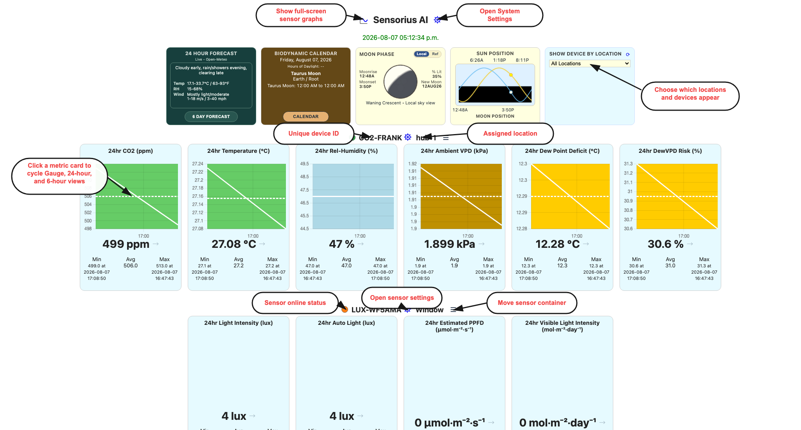

# Sensorius User Guide

Sensorius Automatio Instrumentorum, also called Sensorius AI or Sensorius, is an environmental sensing and automation hub for gardens, greenhouses, grow rooms, small farms, and other places where environmental conditions matter. It gives you live readings, historical graphs, switch control, calibration tools, optional integrations with Home Assistant, WeeWX, and farmOS, and a built-in biodynamic calendar. If the Biodynamic Calendar app is installed on the same host, Sensorius provides the richer companion calendar.

Sensorius can run as a Raspberry Pi hub with directly connected sensors and relays, as well as Wi-Fi Nodus sensors and switches that communicate through MQTT. It can also run on macOS, Windows, or Linux as a hub for Wi-Fi Nodus sensors and switches. In normal use, both kinds of devices appear together on the same dashboard.

This guide is written for people who want to use the system without necessarily knowing all of its back-end functionality. You do not need to understand MQTT, SQLite, or Python to use the app, but the guide explains where information comes from so you can make good decisions when something looks wrong.

## Opening Sensorius

If you installed Sensorius as a service, it starts automatically when the host computer starts or restarts. Wait for the host computer or Raspberry Pi to finish starting; the dashboard will appear after a few seconds. Service installs continue running in the background. To restart a Linux or Raspberry Pi systemd service manually, open a terminal and enter:

```bash
sudo systemctl restart sensorius
```

If you start Sensorius manually, run this from the installed Sensorius folder (the default is `~/Sensorius`):

```bash
cd ~/Sensorius
python3 Sensorius.py
```

The application will start and display the Sensorius dashboard. The first run may take a little longer while it sets up the system's location, database, and calendar data.

The dashboard can also be opened using one of these addresses:

- Same computer: `http://127.0.0.1:8000`
- Local network hostname: `http://<hostname>.local:8000`
- Another device on the same network: `http://<sensorius-host-ip>:8000`

Keep the terminal process running for manual starts.

## Where Sensorius Gets Its Information

Live sensor readings come from local Raspberry Pi sensor controllers and from MQTT-discovered Nodus devices. Sensor readings are written to the local SQLite database, `sensorius_data.db`, in the Sensorius process working directory unless the service or caller passes a different database path. Many service installs use the runtime directory, such as `/Users/<user>/Sensorius/sensorius_data.db` on macOS or `/home/<user>/Sensorius/sensorius_data.db` on Linux.

Sensor and switch names, locations, display choices, calibration offsets, and channel labels come from Sensorius settings files under the macOS runtime settings folder:

- System settings: `/Users/<user>/Sensorius/system_settings/<device_id>/settings.toml`
- Sensor settings: `/Users/<user>/Sensorius/sensor_settings/<sensor_id>/sensor.toml`
- Switch settings: `/Users/<user>/Sensorius/switch_settings/<switch_id>/switch.toml`
- Advanced automations: `/Users/<user>/Sensorius/switch_settings/automations/automations.toml`

For Nodus devices, Sensorius also listens for MQTT metadata and state messages. That metadata tells Sensorius what a device is, which readings or channels it provides, whether it is online, and which remote settings can be updated.

## Dashboard Overview

The dashboard is the main operating view. It is where you check current conditions, see switch state, open settings, and review quick trends.

| Dashboard overview | Dashboard lower sections |
| --- | --- |
|  |  |

The dashboard presents:

- Sensor cards grouped by device and location.
- Switch cards with live channel state and recent events.
- Sun, moon, biodynamic, and optional weather forecast cards when Astral location is available.
- Buttons for System Settings, graph setup, sensor settings, switch settings, and calendar views.

Dashboard data comes from the latest values in the live runtime cache and from the local database. If a device is offline, the latest stored reading may still be visible, but the online/offline state comes from live device status, MQTT heartbeat or availability messages, and recent packets.

### Sensor Cards

Each sensor card shows the sensor ID or name, its location, and the selected metrics for that sensor. The metric names come from the sensor's settings and the measurements that the device reports. Common metrics include temperature, relative humidity, absolute humidity, CO2, VPD, dew point, barometric pressure, soil moisture, soil temperature, soil pH, soil EC, soil nutrients, light, and PPFD.

Each metric tile can appear as:

- **Gauge**: shows the current value against a colored range.
- **6Hr Graph**: shows the last six hours inside the dashboard tile.
- **24Hr Graph**: shows the last 24 hours inside the dashboard tile.

Newly materialized Nodus sensors use **24Hr Graph** for their per-metric display styles. A full day is long enough to show the daily diurnal patterns for heating, cooling, humidity, irrigation, and lighting cycle without opening the full-screen graph, so it is the most useful general-purpose trend view. **System Settings > Display Style** is the system-wide fallback where no per-metric style is supplied; its factory value is **Gauge**. Blank per-metric styles on directly connected local sensors also currently resolve to **Gauge**.

Click a metric tile to cycle **24Hr Graph → 6Hr Graph → Gauge → 24Hr Graph**. This is a convenient temporary view change for the current page. To make the choice persistent, open **Sensor Settings > Sensor Settings**, choose **Gauge**, **6Hr Graph**, or **24Hr Graph** for that metric slot, and click **Save**. **System Settings > Display Style** supplies the fallback when a sensor has no saved style.

The current value comes from the latest reading for that metric. The small history graph comes from `/graph-data`, which reads stored samples from the local database for that sensor and metric.

The solid line is the stored reading series. The dashed line is the arithmetic average of the visible graph window, repeated across the window as a reference line; it is not another sensor reading or an automation set point. The Min, Avg, and Max values below each tile are calculated from the last 24 hours. Min and Max include their exact timestamps so you can correlate an extreme with a switch event, weather change, irrigation cycle, or equipment problem. Consequently, a six-hour tile can show a 24-hour minimum or maximum that lies outside the six hours drawn in the tile.

#### Graph Background Colors And Thresholds

Colored backgrounds use that metric's gauge zones. The colors are metric-specific, not one universal alarm scale. For example:

- Temperature moves from blue for the coldest range, through light blue and green, to yellow and red for hotter ranges.
- Relative humidity uses brown and yellow for dry ranges, light blue for the middle range, and progressively darker blue for wetter ranges.
- CO2 uses green for its central configured range, yellow on either side, and red at the configured extremes.
- AQI progresses from green through yellow, orange, red, purple, and maroon as the index rises.
- VPD uses several moisture-demand bands. The compact tile uses the metric's gauge zones; the full-screen VPD graph uses its dedicated VPD background bands, so its palette is not identical to every compact tile.
- A single-color background, such as barometric pressure's light blue or a light metric's yellow, identifies the metric's scale and does not by itself indicate an alarm.

The boundaries come from Sensorius's gauge-zone configuration for each metric. Changing a zone boundary in that configuration changes where the corresponding background color begins and ends. The standard UI currently exposes gauge size and display style, but not gauge-zone boundary editing. An automation's **Threshold** and **Hysteresis** control when its rule runs; they do not change graph or gauge colors.

#### Metric Ordering

In **Pick 6** mode, the dashboard follows **Metric 1** through **Metric 6** exactly from left to right. You can therefore establish any operational order in **Sensor Settings**. Factory defaults are selected by sensor type and generally put the device's primary measurement first: for example, CO2 is first for a CO2 sensor and Air Quality is first for an AQI sensor. The remaining positions favor closely related temperature, humidity, VPD, dew-risk, pressure, plant, light, or soil measurements for that device.

In **All** mode, Sensorius keeps any saved metric slots first, then appends other known metrics in the application's gauge-configuration order. It does not currently apply a universal rule that moves CO2, AQI, and every other specialized metric farther right. Nor does it guarantee that barometric pressure is always fifth or that dew point fills the fifth position when pressure is unavailable. Use **Pick 6** and assign **Metric 1-6** when that exact convention is important.

#### Sensor Names, Raspberry Pi Buses, And Locations

A directly connected Raspberry Pi sensor ID has the form `<kind>-<bus>-<hostname>`, for example `avpd-i2c-1-sensoria-hub-0`. The kind identifies the sensor family, the bus segment identifies the Linux I2C interface used during discovery, and the final segment identifies the hub. `i2c-1` is the normal sensor bus on GPIO2/GPIO3. `i2c-0` is the secondary bus on GPIO0/GPIO1 used for supported plant-probe arrangements. A dual-bus APVPD device is represented by one sensor ID using its primary `i2c-1` descriptor even though its plant probe also uses `i2c-0`.

The technical sensor or switch ID remains the stable identity used by settings, database history, MQTT, and switch keys. **Location** is the friendly, editable place name used to group and filter dashboard cards and to make automation selectors understandable. A card header shows both: use the ID when diagnosing wiring, topics, or stored settings, and use the location when operating the system. Renaming a location does not rename the device or disconnect its history.

### Switch Cards

Switch cards show local Raspberry Pi relay channels and remote Nodus switch channels through the same interface. Each channel has a label, current state, and recent state changes. Manual toggles send commands through the shared switch controller. For Nodus switches, commands are sent through MQTT and Sensorius waits for state to return from the device.

If an enabled Advanced automation owns a switch channel, Sensorius blocks manual toggles for that channel so the automation remains in control.

Switch state history comes from `saiDataLogger.log_switch_event`, not from synthetic sensor readings. This is why switch events can be overlaid on historical graphs.

Each switch channel also has an auto-off timer. Open the timer control with its gear, enter `0` to disable it or 30-9999 seconds, and click **Ok**. The dashboard accepts values in 30-second steps. The setting is runtime state, not persistent switch configuration, so it must be set again after Sensorius restarts. When a manually controlled channel turns on, the countdown starts; at expiry Sensorius sends one Off command and records a timer-originated switch event. Turning the channel off clears the active countdown. Automation-originated state changes do not start the manual auto-off countdown, and an enabled Advanced automation must be disabled before a manual dashboard toggle is allowed.

The Events column shows up to five recent On/Off transitions, newest first, with timestamps and a **manual** or **auto** origin when one is known. The list combines persisted switch events with live state updates and refreshes as commands and device reports arrive. Those same persisted events can be selected as vertical overlays in the full-screen graph.

## System Settings

System Settings contains hub-level settings, device onboarding, integrations, locations, firmware updates, and maintenance tools.

### System Settings Pane


Fields and selectors:

- **Hostname**: read-only host name for this Sensorius hub. It comes from the active system settings and host runtime.
- **HTTP Port**: web UI port. Valid range is 1 to 65535. The default is usually 8000. Changing it may require a restart or opening the new URL.
- **TLS Enable**: MQTT TLS setting for the Sensorius sensor network. Options are **No** and **Yes**. Use Yes only when the broker is configured for TLS.
- **MQTT Port**: MQTT broker port. Valid range is 1 to 65535. Common values are 1883 without TLS and 8883 with TLS.
- **Sensorius Hub**: MQTT broker hostname or IP used by Sensorius and Nodus devices.
- **Time Zone**: IANA timezone name, such as `America/Denver`. It controls dashboard time labels, graph time labels, Astral timing, and calendar day boundaries.
- **Weather Forecast**: forecast provider for the dashboard and current-day biodynamic summary. Options are **MET Norway**, **US**, **Open-Meteo**, and **None**.
- **Latitude**: Astral latitude. Leave both Latitude and Longitude empty, then Save, to re-detect automatically.
- **Longitude**: Astral longitude. Latitude and Longitude must both be filled for manual coordinates.
- **Altitude (m)**: altitude in meters. Valid range is -500 to 10000.
- **Sunrise**: read-only calculated sunrise for the current Astral location.
- **Sunset**: read-only calculated sunset.
- **Daylight Hours**: read-only daylight duration.
- **Sun Peak Time**: read-only solar noon.
- **Gauge Size**: dashboard gauge size. Options are **Small** and **Large**.
- **Display Style**: default dashboard metric display. Options are **Gauge**, **6Hr Graph**, and **24Hr Graph**.
- **Dashboard**: returns to the dashboard.
- **Save**: writes system settings to `system_settings/<device_id>/settings.toml`.

If the Astral fields are wrong, biodynamic timing, sunrise/sunset automations, and weather forecast placement may also be wrong.

### Edit Locations Pane


The Edit Locations pane lists sensors and switches together.

Fields:

- **Device row label**: shows whether the row is a sensor or switch and shows its ID. Data comes from sensor and switch settings managers.
- **Location input**: updates that device's location. Sensor rows write to `sensor_settings/<sensor_id>/sensor.toml`; switch rows write to `switch_settings/<switch_id>/switch.toml`.
- **Save**: writes all non-empty location changes.

Locations should describe places people recognize: Greenhouse 1, West Bed, Seedling Bench, Main Pump, Hoop House, or Barn Weather Station.

### Add Device Pane


Use Add Device to onboard a factory-bootstrapped Nodus device.

Fields and status rows:

- **Scanning for Nodus_Setup**: Sensorius scans for the Nodus setup access point.
- **Connected to Nodus setup AP**: confirms Sensorius or the host joined the Nodus setup network.
- **Bootstrap sent to Nodus**: confirms Wi-Fi and broker bootstrap information was sent.
- **Sensorius rejoined your Wi-Fi**: confirms the hub returned to the normal network.
- **Waiting for Nodus to reboot and connect**: waits for the Nodus device to reboot, join Wi-Fi, connect to MQTT, and send its hello/config result.
- **Retry**: retries the current onboarding session.
- **Add**: starts onboarding when the setup AP is available or manual joining is required.

On macOS, Sensorius first attempts to join `Nodus_Setup` automatically using native Wi-Fi tooling, including setup networks shown under Other Networks. If automatic joining fails, the pane may instruct you to join `Nodus_Setup` manually from Wi-Fi settings, then return and click Add. For Raspberry Pi deployments that onboard over Wi-Fi, use a 2.4 GHz network path. If the router combines 2.4 GHz and 5 GHz under one SSID, ethernet on the Raspberry Pi is usually the most reliable setup. If Add Device reports `network_control_not_authorized`, the Linux/Raspberry Pi service install did not grant NetworkManager control; use the Operations guide to repair the service authorization.

### Update Device Pane


Use Update Device for Nodus over-the-air (OTA) firmware packages.

OTA has been verified for Nodus packages targeting `pico2w` and `xesp32s3`.
Packages must declare the correct target platform; Sensorius blocks updates
when the package target does not match known device metadata. For Pico 2 W,
avoid large single-file compiled updates: command-line OTA testing showed a
Nodus-side memory allocation failure while transferring an `app.mpy` larger
than about 50 KB.

Future Sensorius releases may accept zip uploads, but the current OTA workflow
expects the package folder produced by `cPyNodus_II` or `cPyNodus_III`.

Fields and controls:

- **Package Folder**: local OTA package folder produced by `cPyNodus_II` or
  `cPyNodus_III`, selected from the Sensorius host.
- **Package summary**: package inspection status after selection or inspection.
- **Package Path**: absolute path to a package on the Sensorius host.
- **Inspect Package**: reads package metadata and validates that Sensorius can use it.
- **Concurrent Updates**: number of devices to update at once. Options are numeric values from 1 to 4.
- **Device list**: Nodus devices available for update. Data comes from known Nodus metadata and OTA endpoints.
- **Refresh Devices**: reloads the device list.
- **Job panel**: active update status and progress.
- **Job history**: recent update result information.
- **Cancel Job**: cancels an active update job when available.
- **Update Device(s)**: starts an OTA update for selected devices after a valid package and target selection are available.

Only update devices when power and network are stable.

### Remove Device Pane


Use Remove Device when a sensor or switch should no longer appear in Sensorius.

Fields and controls:

- **Device checkbox list**: removable devices known from settings, discovery, and runtime state.
- **Device detail**: may show URL or last-seen age when known.
- **I understand this deletes settings and data**: required confirmation checkbox.
- **Remove Selected**: deletes selected device settings and related local data, clears related runtime caches, and attempts to clear retained MQTT/Home Assistant topics.

Before removing a device, update any automations, Home Assistant dashboards, farmOS expectations, or written operating procedures that depend on it.

### Integrations Pane

System Settings presents Home Assistant, WeeWX, and FarmOS under one
**Integrations** menu item. Each integration is an independently expandable
block. Scroll the right pane vertically when the expanded blocks exceed the
available height.

#### Home Assistant


Fields and selectors:

- **Enabled**: turns Home Assistant integration on or off. Options are **No** and **Yes**.
- **Broker**: Home Assistant MQTT broker hostname or IP.
- **TLS Enable**: whether to use TLS for the Home Assistant broker. Options are **No** and **Yes**.
- **Port**: broker port, from 1 to 65535.
- **Username**: MQTT username if required.
- **Password**: MQTT password if required. Stored through Sensorius secret obfuscation.
- **Show**: temporarily reveals the password in the browser.
- **Save**: writes the `[HomeAssistant]` settings.

Expected flow: configure the broker, enable the integration, let Sensorius publish retained discovery topics, then let Home Assistant observe sensors and switches through MQTT.

#### WeeWX


Fields and selectors:

- **MQTT Interface**: enables or disables WeeWX MQTT ingest. Options are **Disabled** and **Enabled**.
- **Runtime state**: shows whether Sensorius is receiving WeeWX data, the latest sample, age, and offline timing.
- **WeeWX Database**: read-only database path, normally `/var/lib/weewx/weewx.sdb` for a WeeWX host.
- **Sensorius Sensor ID**: sensor ID Sensorius uses for WeeWX readings. Default is `weewx-station`.
- **MQTT Topic Filter**: MQTT subscription filter for WeeWX messages. Default is `weewx/#`.
- **Update Period Seconds**: expected update period, from 15 to 3600 seconds.
- **Sensorius Broker**: read-only broker host and port used by Sensorius.
- **Save**: writes the `[WeeWX]` settings and creates WeeWX sensor settings if needed.

When WeeWX runs on the same host and `/etc/weewx/weewx.conf` or
`/home/weewx/weewx.conf` is readable, Sensorius records the active station
model in the WeeWX station sensor settings. The Sensor Settings **Sensor Info**
pane shows it as `Station: <model>`.

If the MQTT topic changes, Sensorius applies the subscription update live when
MQTT ingest is running. If MQTT ingest is not running, the saved setting applies
when MQTT ingest starts.

#### FarmOS


Fields and selectors:

- **Enabled**: turns farmOS export on or off. Options are **No** and **Yes**.
- **Verify TLS**: verifies the farmOS HTTPS certificate. Options are **Yes** and **No**. Leave Yes unless you are testing a private certificate.
- **Base URL**: farmOS site URL, such as `https://farmos.example.com`.
- **Log Bundle**: farmOS log bundle name. Default is `observation`.
- **Access Token (optional)**: static token, if you use token-based auth.
- **Client ID**: OAuth client ID. Default is `farm`.
- **Client Secret**: OAuth client secret.
- **Username**: farmOS username for password-based auth.
- **Password**: farmOS password for password-based auth.
- **Show** buttons: temporarily reveal hidden secret fields in the browser.
- **Test Connection**: calls the farmOS test endpoint and reports success or the last error.
- **Save**: writes the `[FarmOS]` settings.

farmOS export listens for new readings written by Sensorius. Check the FarmOS status if exports stop; it reports enabled state, queue depth, token state, and last error.

### Advanced Pane


Advanced settings affect startup, logging, and stored data. Change them only when you understand the impact.

Fields and controls:

- **Auto-start Sensorius on login**: creates or removes an auto-start entry for Sensorius.
- **Auto-start scope**: **User-level (default)** starts for the current user. **System-level** is for system service style installs and may require elevated permissions outside the web UI.
- **Maximum Days of Data (30-365)**: database retention window. Valid range is 30 to 365 days. This affects how much history graphs can show.
- **SENSORIUS_FILE_LOG**: enables file logging when checked.
- **SENSORIUS_LOG_LEVEL**: logging detail. Options are **DEBUG**, **INFO**, **WARNING**, **ERROR**, and **CRITICAL**.
- **SENSORIUS_DEBUG_MODULES**: module-specific debug checkboxes. Options are loaded from the app's advanced status endpoint.
- **Archive Database**: creates a SQLite database snapshot under `database_archives/` next to the active database and downloads the snapshot.
- **New Database**: archives the current SQLite database, deletes the active database files, and creates a new empty database. This is an intentionally drastic recovery action.
- **Save**: writes advanced settings.

## Sensor Settings

Open Sensor Settings from a sensor card when you need to organize a sensor, choose which readings appear on the dashboard, calibrate readings, or check device health.

### Sensor Settings Pane


Fields and selectors:

- **Location**: the practical place where the sensor is installed, such as Greenhouse, Seed Rack, Bed 2, Propagation Tent, or North Field. This is saved in that sensor's `sensor.toml` and is also used by the dashboard, location editor, and automation selector labels.
- **Metric Set**: controls how many dashboard metrics are shown. **Pick 6** shows the six selected metric slots. **All** shows all metrics that Sensorius knows for the sensor.
- **Metric 1-6**: dashboard metric slots. Options come from the sensor's available metric list. That list is built from device metadata, known database metrics, and Sensorius gauge configuration.
- **Display Style 1-6**: display style for each selected metric. Options are **Gauge**, **6Hr Graph**, and **24Hr Graph**.
- **Dashboard**: closes the modal and returns to the dashboard.
- **Restart Device**: appears for devices that support remote restart, such as supported Nodus devices. It sends a restart request to the device.
- **Save**: writes the changes to `sensor_settings/<sensor_id>/sensor.toml`. For remote Nodus devices, Sensorius also pushes a correlated settings update over MQTT when needed.

Use clear location names. They are visible to nontechnical users and make later automation rules easier to understand.

Metric slot order is authoritative in **Pick 6** mode: Metric 1 is the leftmost tile and Metric 6 is the rightmost. Display Style 1 applies to Metric 1, Display Style 2 to Metric 2, and so on. Saving these fields is the supported way to make a dashboard order or display style persistent.

### Sensor Calibration Pane


The Sensor Calibration pane adjusts the selected physical device. It is meant for cases where one sensor is consistently high or low compared with a trusted reference.

Common fields and controls:

- **Sensor ID**: the Sensorius identifier for this sensor.
- **Device**: device type or label from local settings or Nodus metadata.
- **Location**: the sensor location from Sensor Settings.
- **Ambient Temperature Offset (C)**: correction added to the ambient temperature channel on APVPD-style devices.
- **Ambient RH Offset (%)**: correction added to the ambient relative humidity channel on APVPD-style devices.
- **Altitude Calibration / Offsets**: device-specific numeric offsets exposed by the sensor. Available fields depend on the sensor type and firmware metadata.
- **Calibrate Plant Sensor**: runs the APVPD plant-sensor calibration routine when the device supports it.
- **Calibrate pH 4.0 / 7.0 / 10.0**: soil-sensor pH buffer calibration buttons. Use the matching buffer solution and wait for the probe to stabilize before applying.
- **Soil Offsets**: manual numeric offsets for soil sensor channels such as pH or other exposed calibration values.
- **Apply Device Calibration**: saves the device calibration. For Nodus devices, the command is sent to the device and the local settings shadow is updated.

Calibration data comes from the sensor's `Calibration` section, Nodus metadata, and device-specific calibration endpoints. Apply small changes, then watch the dashboard and graphs to confirm the readings now track your trusted reference.

### System Calibration Pane


System Calibration compares multiple temperature/RH sensors to a reference sensor over recent history.

Fields and selectors:

- **Choose reference sensor**: the trusted sensor used as the baseline. Options come from sensors that report temperature and relative humidity.
- **Cal Range (hours)**: the history window used for comparison. Options are numeric values from 24 to 72 hours.
- **Use**: checkbox for each candidate sensor. Checked sensors are included in the preview and apply step.
- **Sensor ID**: candidate sensor name.
- **Delta Temp (C)**: previewed temperature correction needed to align with the reference.
- **Delta RH (%)**: previewed relative-humidity correction needed to align with the reference.
- **Preview Calibration**: calculates corrections from stored readings without applying them.
- **Apply Calibration**: applies the previewed corrections. It is disabled until a valid preview is available.

This tool reads historical samples from the SQLite database. It works best when sensors have been near each other long enough to collect comparable data.

For the best calibration results:

1. Make sure the Nodus sensors have been added to Sensorius.
2. If possible, place a trusted temperature and relative-humidity gauge with the Nodus sensors. A gauge that records 24-hour minimum, average, and maximum values is especially useful.
3. Before deploying the Nodus sensors to their final locations, place them together in an area that experiences meaningful variation, ideally about 10 C of temperature change and 10 percentage points of relative-humidity change within 24 hours.
4. Allow Sensorius to collect temperature and relative-humidity data from the Nodus sensors for at least 24 hours and up to 72 hours.
5. After at least 24 hours, compare each Nodus sensor's 24-hour minimum, average, and maximum values with the trusted gauge. If you do not have a trusted gauge, compare the temperature and relative-humidity graphs and choose the Nodus sensor that appears to provide the best representation as the reference.
6. Select the reference sensor, check each additional sensor that you want to calibrate, and click **Preview Calibration**. Review the corrections, then click **Apply Calibration**.

### Sensor Info Pane


The Sensor Info pane is a health and diagnostics view.

Fields shown:

- **IP Address**: the last known device IP address from Nodus metadata or runtime network information. Local sensors may show Unknown.
- **Broker**: MQTT broker the remote device is using, when known.
- **Broker Status**: remote broker connection status, when reported.
- **Last 24hr offline events**: offline transitions recorded during the last 24 hours.
- **Uptime since last offline event**: time since the latest offline event, or since you cleared local counters.
- **Last offline event time**: timestamp of the last offline event.
- **Last packet received**: age or timestamp of the most recent packet from the sensor.
- **Data packets received**: packet count known to Sensorius.
- **Clear**: clears the browser-side display baseline for these counters. It does not delete historical database rows.

Use this pane when a sensor appears stale, missing, or unstable.

## Switch Settings

Switches control things such as pumps, fans, lights, valves, heaters, vents, and other relay-driven equipment. A switch may be a local Raspberry Pi relay board or a remote Nodus switch. Sensorius presents both through the same dashboard and settings screens.

Switch state changes are stored as switch events. These events are available for dashboard state, recent-event lists, full-screen graph overlays, and automation review.

Open Switch Settings from a switch card when you need to label channels, set the switch location, build automations, or check switch health.

### Switch Settings Pane


Fields and controls:

- **Location**: where the switch device or relay box is installed. This is saved in `switch_settings/<switch_id>/switch.toml` and is shown on the dashboard and location editor.
- **Channel label for switch_N**: friendly label for each channel, such as Exhaust Fan, Irrigation Pump, Heat Mat, North Vent, or Lights. Labels are saved in switch settings.
- **Dashboard timer gear**: opens the channel's manual auto-off timer. Use `0` to disable it or 30-9999 seconds; the dashboard rounds entries to a 30-second step. The value lasts only until Sensorius restarts.
- **Dashboard**: closes the modal.
- **Restart Device**: appears for supported remote switches and sends a restart request.
- **Save**: writes changes to switch settings. For remote Nodus switches, Sensorius also sends a settings update over MQTT when needed.

Keep labels stable for operator clarity, but the internal switch address is the
stable `<switch_id>::<channel_id>` key.

### Automations Pane


The Automations pane first shows saved automations for the selected switch. Each item shows the automation name and whether it is enabled.

Controls:

- **New**: opens a new automation definition.
- **Saved Automations**: returns from the editor to the saved list.
- **Remove**: deletes the selected automation.
- **Enable** in the editor: sets whether the rule is active. Options are **Yes** and **No**.

Automation rules are stored under the Sensorius runtime directory, such as `/Users/<user>/Sensorius/switch_settings/automations/automations.toml` on macOS or `/home/<user>/Sensorius/switch_settings/automations/automations.toml` on Linux. The editor loads sensor choices from `/sensor-directory`, metric choices from `/sensor-metrics`, switch labels from `/switch-info`, and existing automation rules from `/advanced/automations`.

### Automation Definition Pane


Top-level fields:

- **Automation Name**: friendly name shown in the saved automation list.
- **Enable**: **Yes** activates the automation, **No** saves it but does not run it.
- **Add Condition**: adds another condition row.
- **Add Action**: adds another action row.
- **Save**: saves the automation.

Condition **Type** options:

- **sensor**: compares a sensor metric to a threshold.
- **time of day**: active only inside a daily time window.
- **astral**: uses sunrise or sunset timing from Astral location.
- **timer**: active for a repeated duration, such as 5 minutes every hour.
- **or**: separates groups of conditions. Conditions within a group are AND; groups separated by OR are OR.

Sensor condition fields:

- **Sensor**: sensor to watch. Options are dashboard-visible sensors.
- **Metric**: metric from the selected sensor.
- **Operator**: comparison operator. Options are `>`, `<`, `==`, and `!=`.
- **Threshold**: numeric value used by the comparison.
- **Hysteresis**: buffer around the threshold to reduce rapid on/off cycling.

Time-of-day condition fields:

- **Start Time**: beginning of the active window.
- **Stop Time**: end of the active window.
- **Days**: weekdays when the condition can be true. Options are Mon through Sun.

Astral condition fields:

- **Event**: sunrise/sunset mode. Options are **sunrise to sunset**, **sunset to sunrise**, **sunrise**, and **sunset**.
- **Offset (minutes)**: shifts the event by -120 to 120 minutes. Negative starts before the event; positive starts after.
- **Days**: weekdays when the Astral rule can run.

Timer condition fields:

- **Every**: repeat interval. Options are 5 minutes, 15 minutes, 30 minutes, 1 hour, 3 hours, 6 hours, 12 hours, and 24 hours.
- **Duration**: active duration in minutes, from 1 to 60. Duration must be less than the Every interval.

Action fields:

- **Switch**: channel to control. Options come from labeled channels on this switch and use the stable switch key behind the scenes.
- **State**: **On** or **Off**.
- **Revert Action**: **Previous State** returns the switch to its previous state when the rule is no longer true. **Do Nothing** leaves the switch where the action put it.
- **Delay Before Action (secs)**: waits 0 to 60 seconds after the rule becomes true before applying the action.

Actions set absolute states, not toggle or invert commands. All actions in one automation share the same condition groups. **Previous State** is captured when an action actually changes a switch; if the switch is already at the requested state, there is no new previous state for that action to restore.

To alternate two switch channels in one timer automation:

1. Disable the automation.
2. Put the channels in their normal baseline state manually. For example, set Green **On** and Yellow **Off**.
3. In the automation action rows, choose the state wanted during the timer window. For example, set Green **Off** and Yellow **On**.
4. Set **Revert Action** to **Previous State** for both rows.
5. Save and enable the automation.

With that setup, the timer window applies the action states, and the end of the window restores the manually set baseline state.

For critical loads, test automations with harmless equipment first. A short delay and hysteresis can prevent relay chatter when readings hover near a threshold.

### Switch Info Pane


The Switch Info pane shows:

- **IP Address**: last known IP address for a remote switch.
- **Broker**: MQTT broker reported by the switch.
- **Broker Status**: remote broker connection status.
- **Last 24hr offline events**: offline transitions during the last 24 hours.
- **Uptime since last offline event**: time since the latest offline event or local clear baseline.
- **Last offline event time**: timestamp of the last offline event.
- **Last packet received**: age or timestamp of the most recent packet.
- **Switch current state, age**: per-channel state and how long that state has been known.
- **Clear**: clears the browser-side display baseline for statistics.

Use this pane when commands do not seem to reach a switch or when a remote relay appears to drop offline.

## Graph & History

Open the graph tool when you want to compare readings over time, investigate spikes, or see whether a switch action changed the environment.


The full-screen graph displays one to three metric series. The first selected metric uses the left axis. The second and third selected metrics use the right axis. When average data is available, a purple dashed line labeled **Average** shows that series' arithmetic average over the selected visible window. VPD graphs show VPD range coloring, and some metrics show gauge-zone background bands. These colored bands come from metric display zones, not automation thresholds.

Switch event overlays appear as vertical lines. The legend shows which colors mean ON and OFF for each selected switch channel.

### Graph Definition Modal


The graph definition modal has these panes and fields:

- **Saved Graph Setups**: saved graph configurations. These are stored in system settings under the `GraphModal` section. Click a saved setup to load its sensors, metrics, time range, and switch overlay choices.
- **Remove**: deletes the selected saved graph setup.
- **Left Y-Axis sensor selector**: chooses the sensor for the left-axis metric. Options come from `/sensor-ids`, which combines dashboard-visible local and MQTT-discovered sensors.
- **Left Y-Axis metric selector**: chooses the metric for the left axis. Options come from `/sensor-metrics`, first from the database's known metric names and then from live sensor metadata if needed.
- **Right Y-Axis A sensor and metric selectors**: optional second metric. It is useful for comparing related readings such as temperature and humidity.
- **Right Y-Axis B sensor and metric selectors**: optional third metric.
- **Time Range**: preset history windows. The available day ranges depend on the configured database retention period. Common options are 1Hr, 3Hr, 6Hr, 12Hr, 24Hr, 3Day, 7Day, and the configured maximum day range.
- **Custom**: lets you enter exact start and end date/time values. Both must be filled before graphing.
- **Switch Transitions switch selector**: optional switch whose events should be shown on the graph. Options come from switch settings.
- **Channel checkboxes**: optional switch channels to overlay. Options come from the selected switch's channel labels.
- **Home**: closes the graph setup modal.
- **Save**: saves the current graph setup after asking for a setup name.
- **Graph It**: loads data from `/graph-data` and opens the full-screen graph.
- **Close** on the full-screen graph: returns to the dashboard.

Use switch overlays to answer practical questions: whether a fan cooled the greenhouse, whether irrigation raised soil moisture, or whether lights changed VPD.

## BD Calendar

Sensorius includes a built-in biodynamic calendar and can also open the standalone Biodynamic Calendar app when that app is running on the same host.

The built-in month view includes a color legend for Root, Leaf, Flower, Fruit,
Rest, and Transition periods above the calendar grid.

The built-in calendar is part of the Sensorius dashboard. It uses Sensorius Astral settings for latitude, longitude, altitude, and timezone. Calendar notes and daily summaries are stored in the Sensorius SQLite database in `biodynamic_notes` and `biodynamic_daily_summaries`.

The standalone app lives at `~/Projects/Biodynamic_Calendar`, which is `/Users/twfarley/Projects/Biodynamic_Calendar` for this installation. It can run beside Sensorius on port `8765`. When you click the dashboard **Calendar** button, Sensorius checks `http://127.0.0.1:8765/healthz`. If the companion app is available, Sensorius opens it in an overlay at:

```text
http://<sensorius-host>:8765/?source=sensorius
```

If the companion app is not available, Sensorius opens the built-in calendar modal.

### Built-In Calendar

The built-in calendar shows:

- Current biodynamic sign, element, and plant focus.
- Current day's biodynamic windows.
- Month navigation.
- Day cells colored by dominant biodynamic influence.
- Daily Summary for the selected day.
- Daily Notes for the selected day.
- Save Note.
- Print Report for the selected month calendar with dated daily summaries and notes.

Daily summaries come from Sensorius' biodynamic summary storage. For the current day, the summary may include a **24hr Forecast** section if weather forecast data is enabled in System Settings.

The built-in calendar is best for quick dashboard use: checking today's planting focus, adding a note, printing a monthly report, and reviewing daily summaries without leaving Sensorius.

### Companion Biodynamic Calendar App


The companion app has more capabilities than the built-in calendar:

- A full standalone calendar UI.
- Sun/Moon Position panel with a 24-hour position graph.
- Clickable 29-day Sun/Moon position and moon phase overlay.
- Moon Phase panel with **Local** and **Ref** modes.
- Manual and automatic location management.
- Next 12 Months overview.
- Planting records with crop details.
- Notes and print reports.
- Sensorius SQLite storage support when started with `SENSORIUS_DB_PATH` or `BD_CALENDAR_STORE=sensorius`.

Companion app fields and controls:

- **Latitude**: manual latitude for calendar and Astral calculations. If the app is using Sensorius storage, this can come from Sensorius Astral settings.
- **Longitude**: manual longitude. Latitude and longitude must both be filled for manual location.
- **Timezone**: IANA timezone name such as `America/Denver`. It controls day boundaries and displayed times.
- **Save Location**: stores the entered latitude, longitude, and timezone.
- **Reset Location**: clears manual location and re-runs auto-detection. Auto-detection prefers Sensorius Astral settings, then IP geolocation, then a timezone-city fallback.
- **Local / Ref** in Moon Phase: switches between the local visual moon orientation and a reference moon phase view.
- **Previous / Next month arrows**: move the main month calendar.
- **Calendar day cells**: select a day. The selected day drives the Daily Summary, selected facts, notes, and planting context.
- **Next 12 Months**: shows a longer planning range. It comes from the companion app's calendar range API and uses the same location.
- **Daily Summary**: explains the selected day, including biodynamic focus and relevant timing.
- **Plant**: crop or plant name, such as Tomato.
- **Variety**: cultivar or variety name.
- **Focus**: biodynamic plant focus. Options are Auto, Root, Leaf, Flower, and Fruit. Auto lets the app infer the focus from crop information when possible.
- **Start**: start method. Options are Seed and Transplant.
- **Start Date**: planned or actual seeding/transplant date.
- **Harvest**: expected harvest date.
- **Days to Maturity**: optional number from 1 to 730 days.
- **Location**: bed, greenhouse, field, tray, or other practical planting location.
- **Plant Type**: descriptive crop class, such as fruiting vegetable.
- **Attributes**: free-form notes for spacing, succession, hardening, trellis, harvest window, or other crop details.
- **Save Planting**: stores or updates the planting record.
- **Clear**: clears the planting form.
- **Edit / Delete** in the planting list: updates or removes an existing planting record.
- **Your Notes**: free-form note for the selected day.
- **Save Note**: stores the note for that date.
- **Print**: prints the selected calendar/report view.

Run the companion app on the same host as Sensorius:

```bash
cd /Users/twfarley/Projects/Biodynamic_Calendar
SENSORIUS_DB_PATH=/Users/<user>/Sensorius/sensorius_data.db \
PYTHONPATH=src uvicorn biodynamic_calendar_app.app:app --host 0.0.0.0 --port 8765
```

Adjust `SENSORIUS_DB_PATH` if your active Sensorius database is in a different working directory. For direct use, open `http://127.0.0.1:8765/` on the host or `http://<sensorius-host-ip>:8765/` from another device on the same network.

## Good Operating Habits

- Use names and locations that match how people talk about the garden or farm.
- Test automations with harmless loads before connecting pumps, heaters, valves, or lights.
- Use hysteresis and short delays on threshold rules.
- Watch graphs after calibration changes.
- Keep MQTT broker addresses stable once Nodus devices or Home Assistant depend on them.
- Back up `sensor_settings/`, `switch_settings/`, `system_settings/`, and `sensorius_data.db` before major changes.
- Restart Sensorius after changes that affect startup, host binding, service setup, or MQTT subscriptions when the UI or save message indicates a restart is needed.

## Troubleshooting

If a sensor does not appear:

- Confirm Sensorius is running and the dashboard is reachable.
- For Nodus devices, confirm the device is powered, on the expected Wi-Fi, and publishing MQTT metadata.
- Check **Sensor Info** for last packet and offline events.
- Refresh the dashboard after onboarding or metadata changes.

If readings look wrong:

- Confirm the sensor is in the intended location.
- Compare against a trusted reference before calibrating.
- Use **Sensor Calibration** for one device and **System Calibration** for groups of similar temperature/RH sensors.
- Check whether the metric shown is the one you intended in **Sensor Settings > Metric 1-6**.

If switch control does not work:

- Confirm the switch is online in **Switch Info**.
- Check channel labels in **Switch Settings**.
- For Nodus switches, confirm MQTT command and state topics are flowing.
- Check whether an enabled Advanced automation is controlling the same channel.

If graphs have gaps:

- Confirm the sensor was online during the missing period.
- Check whether Sensorius or the host restarted.
- Check database retention in **System Settings > Advanced**.
- Confirm the selected metric exists for the selected sensor.

If Home Assistant does not show entities:

- Confirm Home Assistant integration is enabled.
- Verify broker host, port, TLS, username, and password.
- Confirm Home Assistant's MQTT integration is running.
- Restart Home Assistant or reload MQTT entities if retained discovery was recently changed.

If the Biodynamic Calendar is unavailable:

- Confirm latitude, longitude, and timezone in **System Settings > System Settings**.
- If using the companion app, confirm `http://127.0.0.1:8765/healthz` returns `ok` on the Sensorius host.
- If using the built-in calendar, confirm Sensorius can write to the SQLite database for notes and summaries.

## Related Documentation

- Setup: `docs/setup.md`
- Operations: `docs/operations.md`
- Architecture: `docs/architecture.md`
- Configuration: `docs/configuration.md`
- Sensors and metrics: `docs/sensors.md`
- Switch automations: `docs/automations.md`
- MQTT: `docs/mqtt.md`
- Home Assistant: `docs/homeassistant.md`
- farmOS: `docs/farmos.md`
- Hardware: `docs/hardware.md`
- Biodynamic companion notes: `docs/biodynamic_calendar_companion.md`
